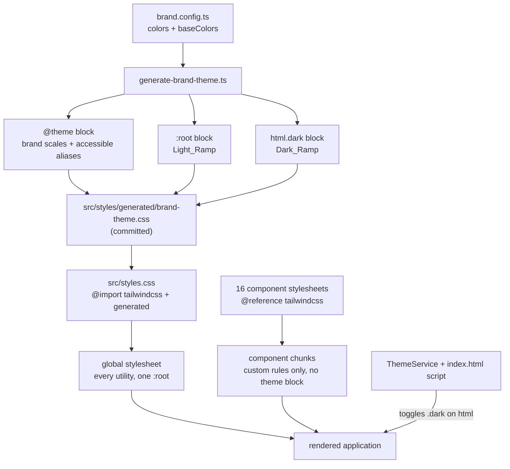

# Design Document

## Overview

This feature adds two `Base_Color` anchors to `Brand_Config` and derives the application's entire neutral surface family from them at build time, one ramp per theme. It reuses the existing `branding-customization` machinery — same config file, same normalization pattern, same generator script, same `prebuild` / `prestart` wiring — and extends it rather than building a parallel system.

Three parts, in dependency order:

1. **Unblock the cascade.** Remove `@import "tailwindcss"` from all sixteen component stylesheets. Without this, nothing else in this feature has any visible effect outside `<body>`.
2. **Derive and emit the ramps.** Extend `generate-brand-theme.ts` to compute a `Light_Ramp` and a `Dark_Ramp` from the two anchors and emit them as plain-CSS overrides of `--color-gray-*` and `--color-white`.
3. **Close the leaks.** Migrate the `slate-*` utilities and hardcoded neutral hex/rgba values that bypass the variables entirely.

### The root cause, stated precisely

This is the single most important thing for an implementer to understand, because it is counterintuitive and it invalidates the obvious approach.

Every Tailwind utility resolves through a CSS variable. Verified in the built output:

```css
.bg-white       { background-color: var(--color-white) }
.bg-gray-50     { background-color: var(--color-gray-50) }
.text-white     { color: var(--color-white) }
.border-gray-200{ border-color: var(--color-gray-200) }
```

So overriding the variables is a legitimate mechanism and needs no template changes. The problem is *where* those variables get declared.

Sixteen component stylesheets contain `@import "tailwindcss"`. Each one emits Tailwind's full theme block, and Angular's emulated encapsulation rewrites the selector. From `dist/ai.client/browser/chunk-35AGSY2X.js`:

```css
@layer theme {
  [_ngcontent-%COMP%]:root, [_nghost-%COMP%] {
    --color-gray-50: oklch(98.5% .002 247.839);
    /* … the entire default gray scale … */
    --color-white: #fff;
  }
}
```

`[_ngcontent-…]:root` never matches — `<html>` carries no content attribute. But `[_nghost-…]` matches the component's own host element. `app.css` is attached to `app-root`, so `<app-root>` re-declares the default gray scale and `--color-white` for the entire application subtree. Custom property resolution walks to the nearest ancestor that declares the property, and that is now `app-root`, not `:root`. A global `:root` override loses unconditionally.

`<body>` is the only element outside `app-root`, which is why the earlier attempt changed `body`'s background and nothing else, and why the sidenav was untouched.

Twenty-three built chunks were found to contain a `--color-gray-900:` *definition*, confirming the duplication is pervasive rather than isolated.

Brand accent colors are immune because `--color-primary-*` is not a Tailwind default. It is defined once in the global `:root` (from the generated `@theme` block) and the component-host blocks never mention it, so it inherits cleanly. Confirmed: zero chunks define `--color-primary-500`; they only reference it.

### Why `@reference` is the right fix

Tailwind v4 provides `@reference "tailwindcss";` for exactly this situation — it makes theme values, custom variants, and theme functions available to a stylesheet while emitting no CSS. Present in the installed `tailwindcss@4.2.4`.

Removing the per-component imports is safe because the global stylesheet already emits every utility the application uses. Verified against `dist/ai.client/browser/styles-*.css`: it contains `.bg-slate-800\/70` and `.bg-slate-100`, which appear **only** inside inline `template:` strings in `.ts` files — so Tailwind's automatic source detection from the global entry point is already scanning everything. Conversely, component-only custom classes (`sidenav-panel-enter`, `artifact-pane-open`, `approval-prompt`) appear only in the component chunks, so those stylesheets still carry real content and must be kept.

Specificity is also safe. The component-scoped utility copies currently sit at `.bg-white[_ngcontent-x]`, and after removal the global `.bg-white` applies. Both live in `@layer utilities`, and layered rules always lose to unlayered rules regardless of specificity — so the hand-written unlayered rules in each component stylesheet (`nav a.active`, `.sidenav.collapsed`, and so on) continue to win either way. The change is expected to be pixel-neutral, and it is the whole point of the Phase 0 checkpoint to confirm that.

Secondary benefit: each of those chunks currently carries a duplicate copy of the theme block, which is why `angular.json` needs a 200 kB warning / 500 kB error `anyComponentStyle` budget. Expect a sharp drop.

### Key design decisions

- **Override the existing `gray` and `white` variables; do not introduce new token names.** The application has 2041 `bg-gray-*`, 5024 `text-gray-*`, 1820 `border-gray-*`, 1030 `dark:bg-gray-*`, and 811 `bg-white` call sites. Migrating them to `surface-*` tokens is a ~10,000-edit change with no functional benefit over overriding the variables they already read.
- **Two ramps over one set of variable names.** `gray` is shared: light mode uses `50–300` for surfaces and `500–900` for text, dark mode uses the reverse. One ramp anchored on one base cannot serve both. So the generator emits two ramps, both preserving the lightest-to-darkest ordering, differing in tint and in where the surface band sits.
- **Ramps are plain CSS, not `@theme`.** `@theme` can only write `:root`; the `Dark_Ramp` needs `html.dark`. Plain unlayered rules also beat `@layer theme`, which is precisely the override behavior wanted. As a bonus, plain declarations are not subject to Tailwind's unused-variable tree-shaking.
- **Lightness comes from the Reference_Ladder; only the surface band moves.** Text steps keep their current absolute lightness, so every text-contrast relationship in the application is preserved by construction rather than by hope. Only the near-surface steps compress to make room for the anchor.
- **Anchor light on the raised surface, dark on the page.** In light mode the visible anchor is the card (`--color-white`, 811 call sites); in dark mode it is the page (`--color-gray-900`, which `html.dark body` already reads). Anchoring each theme where the eye lands makes the config predictable: "I set `#FAF7F2` and my cards are `#FAF7F2`."
- **Contrast is verified, not assumed.** The generator already contains WCAG contrast math for the brand accessible aliases. Reuse it to validate the surface/border/text pairs the application actually relies on, and adjust or fall back with a warning rather than emitting an inaccessible theme.

### Scope boundaries

Build-time only, matching `branding-customization`. No admin UI, no persistence, no runtime overrides. Status (`state-*`) and category identity (`vendor-*`, `filetype-*`) tokens deliberately do not follow the base color — a red error banner stays red.

## Architecture



### Two clocks

| Concern | When resolved | Mechanism |
|---|---|---|
| Base_Color → Neutral_Scale | Build time | `Neutral_Scale_Generator` writes literal `oklch()` values |
| Which ramp is active | Runtime | `.dark` class on `<html>`, set by `ThemeService` and the pre-bootstrap script in `index.html` |
| Chart / canvas neutrals | Runtime | resolved from computed style, because Chart.js needs a color string |

### Emitted file shape

`src/styles/generated/brand-theme.css` grows two blocks after the existing `@theme`:

```css
@theme {
  /* brand scales + accessible aliases — unchanged shape */
}

/* Light_Ramp */
:root {
  --color-white:     oklch(…);
  --color-gray-50:   oklch(…);
  /* … through 950 … */
}

/* Dark_Ramp */
html.dark {
  --color-white:     #fff;
  --color-gray-50:   oklch(…);
  /* … through 950 … */
}
```

`html.dark` matches the existing convention in `styles.css` (`html.dark body { … }`) and sits at specificity (0,1,1), above `:root`'s (0,1,0). Both blocks are unlayered, so they beat every `@layer theme` declaration. Once Phase 0 lands there are no competing `[_nghost-…]` declarations to fight.

## Components and Interfaces

### Base_Config (`src/branding/brand.config.ts`)

```typescript
export const BRAND_CONFIG: BrandConfig = {
  logo: { … },
  appName: "…",
  greetingTemplates: [ … ],
  fallbackGreetings: [ … ],
  colors: { primary: '…', secondary: '…', tertiary: '…' },
  baseColors: {
    light: '#ffffff',
    dark:  '#101828',
  },
  pageTitle: "…",
};
```

### Types (`src/branding/brand.types.ts`)

```typescript
export interface BrandBaseColors {
  /** Anchors the light theme's Raised_Surface (cards, panels, inputs). */
  light: HexColorInput;
  /** Anchors the dark theme's Page_Surface (application background). */
  dark: HexColorInput;
}

export interface BrandConfig {
  // … existing fields …
  baseColors: BrandBaseColors;
}
```

### Defaults (`src/branding/brand.defaults.ts`)

```typescript
export const DEFAULT_BASE_COLORS: BrandBaseColors = Object.freeze({
  light: '#ffffff',
  dark:  '#101828',   // nearest hex to oklch(21% 0.034 264.665) = gray-900
});
```

The `dark` default must be verified by round-tripping through the generator's existing `hexToOklch`, and the resulting OKLCH must land within the Requirement 8.2 tolerance of `gray-900`. If `#101828` does not, pick the hex that does and record the measured deviation in a comment.

### Normalization (`src/branding/brand-config.normalize.ts`)

Add `normalizeBaseColorRole` and `normalizeBaseColors`, mirroring `normalizeColorRole` / `normalizeColors` exactly — same `HEX_COLOR_PATTERN`, same `BrandConfigError` shape, same independent per-role defaulting. Add `baseColors` to `NormalizedBrandConfig` and wire it into `normalizeBrandConfig`.

`BrandingService` does not need to expose `baseColors` — like `colors`, they are consumed only at build time. But `resolveBranding` should still destructure and discard them so the normalization errors continue to reach `configErrors` and the developer console.

### Neutral_Scale_Generator (`scripts/branding/generate-brand-theme.ts`)

Extends the existing module. New exports, following the existing pure-function-plus-guarded-entry-point structure:

```typescript
export type NeutralStep = 50 | 100 | 200 | 300 | 400 | 500 | 600 | 700 | 800 | 900 | 950;

/** Tailwind v4 default gray, read from node_modules/tailwindcss/theme.css. */
export const REFERENCE_LADDER: Record<NeutralStep, { l: number; c: number; h: number }>;

/** Maximum chroma any derived neutral step may carry. */
export const NEUTRAL_CHROMA_CEILING = 0.04;

/** Below this chroma a Base_Color is treated as achromatic. */
export const CHROMA_EPSILON = 0.001;

export function generateNeutralRamp(
  theme: 'light' | 'dark',
  baseHex: string,
  warnings: BrandConfigError[],
): { css: string; resolved: Record<NeutralStep | 'white', { l: number; c: number; h: number }> };

export function generateBaseTheme(config: BrandConfig): { css: string; errors: BrandConfigError[] };
```

`generateBrandTheme` keeps its current signature and output so the existing golden test stays valid. `run()` concatenates `wrapInThemeBlock(brandCss)` with the two ramp blocks.

## Data Models

### Reference_Ladder

Tailwind v4.2.4 default `gray`, verified against `node_modules/tailwindcss/theme.css`:

| step | L | C | H |
|---|---|---|---|
| 50 | 0.985 | 0.002 | 247.839 |
| 100 | 0.967 | 0.003 | 264.542 |
| 200 | 0.928 | 0.006 | 264.531 |
| 300 | 0.872 | 0.010 | 258.338 |
| 400 | 0.707 | 0.022 | 261.325 |
| 500 | 0.551 | 0.027 | 264.364 |
| 600 | 0.446 | 0.030 | 256.802 |
| 700 | 0.373 | 0.034 | 259.733 |
| 800 | 0.278 | 0.033 | 256.848 |
| 900 | 0.210 | 0.034 | 264.665 |
| 950 | 0.130 | 0.028 | 261.692 |

Plus `white` at L = 1.000, C = 0.

Two derived constants, both read from this table rather than hardcoded:

- `RAISED_PAGE_DELTA_LIGHT = 1.000 − 0.985 = 0.015` — how much lighter a card is than the page today.
- `PAGE_RAISED_DELTA_DARK  = 0.278 − 0.210 = 0.068` — how much lighter a dark card is than the dark page today.
- `PAGE_DEEP_DELTA_DARK    = 0.210 − 0.130 = 0.080` — how much darker `gray-950` is than the dark page today.

### Derivation algorithm

Given a `Base_Color` hex, compute `(L_b, C_b, H_b)` via the existing `hexToOklch`.

**Tint (both ramps, identical rule).**

```
if C_b <= CHROMA_EPSILON:
    # achromatic base — reproduce the Reference_Ladder exactly (Requirement 3.11)
    chroma[step] = REFERENCE_LADDER[step].c
    hue[step]    = REFERENCE_LADDER[step].h
else:
    chroma[step] = min(C_b, NEUTRAL_CHROMA_CEILING)   # constant across the ramp
    hue[step]    = H_b
```

Constant chroma is chosen over a per-step profile because it is predictable and easy to reason about: the whole neutral family carries the base's tint at the same strength. The ceiling of `0.04` is roughly Tailwind's own maximum gray chroma (`0.034` at step 700) plus headroom — enough for a clearly tinted neutral family, low enough that `#ff0000` (C ≈ 0.25) produces a warm grey rather than pink. Exceeding it records a warning per Requirement 3.10.

`--color-white` in the light ramp carries the base's chroma unclamped, because it *is* the base color, emitted verbatim.

**Light_Ramp lightness.**

```
L[white] = L_b                                  # the anchor, exact (R3.3)
L[50]    = L_b - RAISED_PAGE_DELTA_LIGHT        # preserves today's separation (R3.4)
L[100..300] = remapLinear(
    REFERENCE_LADDER[step].l,
    from: [0.985, 0.707],      # today's gray-50 … gray-400
    to:   [L[50],  0.707],     # compressed top, fixed bottom
)
L[400..950] = REFERENCE_LADDER[step].l          # Text_Steps untouched (R3.12)
```

Only `50`–`300` move. Those are the surface and border steps. `400` is the pivot and is unchanged, so every step from `400` down keeps its exact current lightness and therefore its exact current contrast against white-ish backgrounds. When `L_b = 1.0`, the remap is the identity and the ramp reproduces the Reference_Ladder.

**Dark_Ramp lightness.**

```
L[900]   = L_b                                          # the anchor, exact (R3.5)
L[800]   = clamp01(L_b + PAGE_RAISED_DELTA_DARK)        # preserves separation (R3.6)
L[950]   = clamp01(L_b - PAGE_DEEP_DELTA_DARK)
L[700..500] = remapLinear(
    REFERENCE_LADDER[step].l,
    from: [0.373, 0.446],                # today's gray-700 … gray-600
    to:   [max(L[800] + 0.02, 0.373), 0.446],
)
L[400..50] = REFERENCE_LADDER[step].l               # dark-mode Text_Steps untouched
L[white]   = 1.000                                 # pure white in dark mode
```

The `700..500` remap exists to stop `gray-700` from landing below `gray-800` when someone picks a light "dark" base. `gray-400` and above are dark mode's text and icon steps and stay put.

`--color-white` stays literal `#fff` in the dark ramp. Dark mode's raised surface is `gray-800`, not white; `text-white` and the 43 `dark:bg-white` inverted-chip usages need real white there.

**Post-derivation contrast pass (Requirement 5).**

Verify these pairs, using the existing `contrastRatio`:

| Theme | Foreground | Background | Target |
|---|---|---|---|
| light | gray-500, 600, 700, 800, 900 | white, gray-50, gray-100 | 4.5:1 |
| light | gray-200, gray-300 | white, gray-50 | 3:1 |
| dark | gray-100, 200, 300, 400 | gray-900, gray-800 | 4.5:1 |
| dark | gray-600, gray-700 | gray-900, gray-800 | 3:1 |

On failure, walk the failing step's lightness toward the Reference_Ladder value in `LIGHTNESS_SEARCH_STEP` increments until it passes, recording a warning. If it still fails at the Reference_Ladder value, emit the Reference_Ladder value and record an error. Re-check monotonicity after any adjustment, and if an adjustment would break ordering, fall back that step to the Reference_Ladder instead.

**Emission.** Literal `oklch(L% C H)` strings, matching the `state.css` convention of literals over `var()` references. Round L to 1 decimal place as a percentage, C to 3 decimals, H to 3 decimals, so output is stable and diffable.

### Brand accessible-alias coupling (Requirement 6)

`generate-brand-theme.ts` currently hardcodes:

```typescript
const DARK_SURFACE_OKLCH = { l: 0.21, c: 0.034, h: 264.665 } as const;
```

This is a copy of `gray-900` and is the background reference for every `--color-{role}-accessible-dark` alias. It must become the *resolved* `Dark_Ramp` `gray-900` — that is, the dark `Base_Color` itself. Otherwise every brand accent's dark-mode contrast guarantee is computed against a surface that is no longer on screen. Order of operations in `run()`: resolve the ramps first, then generate the brand theme using the resolved dark page surface.

Similarly, `findAccessibleLightnessDelta` for the light-mode alias currently uses literal white as the background. That should become the resolved light `Raised_Surface`.

The comment in the generator claiming `DARK_SURFACE_OKLCH` is "kept in sync with the `html.dark body` background in src/styles.css" needs updating — the dependency now runs the other way.

### Neutral leak inventory (Requirement 7)

Found by audit; the implementer should re-run the searches rather than trust this list to be exhaustive.

**`slate-*` utilities — 9 files:**

| File | Notes |
|---|---|
| `session/components/message-list/components/oauth-consent-prompt/oauth-consent-prompt.component.ts` | `dark:bg-slate-800/70`, `dark:bg-slate-900` |
| `session/components/message-list/components/tool-approval-prompt/tool-approval-prompt.component.ts` | `dark:bg-slate-800/70`, `dark:bg-slate-900`, `dark:bg-slate-900/60` |
| `session/components/message-list/components/message-metadata-badges.component.ts` | `bg-slate-100`, `text-slate-700`, `dark:bg-slate-800/60`, `dark:text-slate-300`, `text-slate-500`, `dark:text-slate-400` |
| `session/components/message-list/components/mcp-app-card/mcp-app-card.component.ts` | `dark:bg-slate-800/70`, `dark:bg-slate-900` |
| `session/components/message-list/components/mcp-app-consent-prompt/mcp-app-consent-prompt.component.ts` | `dark:bg-slate-800/70`, `dark:bg-slate-900` |
| `session/components/chat-input/chat-input.component.html` | `dark:bg-slate-800` ×2 |
| `components/storage-quota-banner/storage-quota-banner.component.ts` | `dark:bg-slate-800` |
| `components/quota-warning-banner/quota-warning-banner.component.ts` | `dark:bg-slate-800` ×2 |
| `components/model-dropdown/model-dropdown.component.ts` | `dark:text-slate-400` ×2 |

Map each to the same-numbered `gray-*` step. Tailwind's `slate` and `gray` differ only in hue and a little chroma at equal steps, so this is a near-invisible change today and becomes correct once the ramps are tinted.

**Hardcoded neutral hex / rgba in component styles:**

| File | Notes |
|---|---|
| `shared/constants/chart-colors.constants.ts` | `CHART_CHROME` light/dark: tooltip background, title/body text, border, axis text, grid line. Must resolve from computed style at runtime — Chart.js needs a color string. |
| `admin/costs/components/model-breakdown.component.ts` | `'#ffffff'` doughnut segment border |
| `session/components/message-list/components/artifact/artifact-card.component.ts` | `#6b7280`, `#374151`, several `rgba(255,255,255,…)` |
| `session/components/assistant-indicator/assistant-indicator.component.ts` | `rgb(30 41 59) /* slate-800 */` ×2, several `rgba()` |
| `session/components/message-list/components/tool-use/renderers/mcp-app-frame.component.ts` | `#4b5563`, `#d1d5db`, `#f3f4f6` shimmer gradient |
| `session/components/message-list/components/file-attachment/file-attachment-badge.component.ts` | `--corner-bg: #f3f4f6` / `#374151` |
| `not-found.page.ts` | `rgba(255,255,255,…)`, `rgba(0,0,0,…)` — decorative; document and retain |
| `session/components/message-list/components/artifact/artifact-panel.component.ts` | `rgba(255,255,255,0.45)` shimmer — decorative; document and retain |

**Other:**

- `components/sidenav/sidenav.css`: `.dark nav a.active { color: white }` uses the CSS keyword. Should read `var(--color-white)`.
- `styles.css` `.message-block`: `tr:nth-child(odd) td { background-color: white }` — same issue.
- `shadow-[0_1px_2px_rgba(15,23,42,0.04)]` arbitrary shadows encode slate-900. Low priority; black-alpha shadows read correctly on a tinted surface, so these can be normalized to `rgba(0,0,0,0.04)` or left with a comment.

Black-alpha `rgba(0,0,0,…)` shadows and `rgba(255,255,255,…)` dark-mode surface washes are **correct as-is** — they compose over whatever surface is beneath them and therefore already follow the base color. Only opaque neutral values need migrating.

## Correctness Properties

*A property is a characteristic or behavior that should hold true across all valid executions of a system — essentially, a formal statement about what the system should do. Properties serve as the bridge between human-readable specifications and machine-verifiable correctness guarantees.*

The `Neutral_Scale_Generator` is a pure function from two hex strings to CSS, which makes it well suited to property-based testing. The cascade fix, theme switching, and leak closure are covered by guard specs, golden tests, and manual verification instead.

### Property 1: Ramp structure

*For any* pair of valid 6-digit `Base_Color` hexes, the generator emits exactly two ramp blocks — one scoped to `:root` and one to `html.dark` — each containing exactly twelve declarations: `--color-gray-{step}` for the eleven steps in ascending order, plus `--color-white`.

**Validates: Requirements 3.1, 3.2**

### Property 2: Monotonic lightness within each ramp

*For any* pair of valid `Base_Color` hexes, within each emitted ramp the OKLCH lightness decreases strictly and monotonically from step 50 through step 950, and `--color-white` is at least as light as step 50.

**Validates: Requirements 3.7, 5.6**

### Property 3: Anchors are exact

*For any* valid light `Base_Color`, the emitted `:root` `--color-white` resolves to that exact color; and *for any* valid dark `Base_Color`, the emitted `html.dark` `--color-gray-900` resolves to that exact color.

**Validates: Requirements 3.3, 3.5**

### Property 4: Surface separation is preserved

*For any* pair of valid `Base_Color` hexes, the light ramp's `white`-to-`gray-50` lightness separation and the dark ramp's `gray-900`-to-`gray-800` separation each equal the corresponding `Reference_Ladder` separation, unless a documented clamp at the 0 or 1 lightness boundary applies.

**Validates: Requirements 3.4, 3.6, 5.5**

### Property 5: Tint derivation is bounded

*For any* valid `Base_Color`, every emitted step's chroma is at most `NEUTRAL_CHROMA_CEILING`, every emitted step's hue equals the base's hue when the base is chromatic, and every emitted step reproduces the `Reference_Ladder`'s own hue and chroma when the base is achromatic.

**Validates: Requirements 3.8, 3.9, 3.10, 3.11**

### Property 6: Contrast guarantees hold

*For any* pair of valid `Base_Color` hexes, every verified foreground-and-background pair in the emitted ramps meets its WCAG target — 4.5:1 for text steps, 3:1 for border steps — against both the `Page_Surface` and the `Raised_Surface` of its own theme.

**Validates: Requirements 5.1, 5.2, 5.3, 5.4**

### Property 7: Generator determinism and independence

*For any* valid `Base_Config`, generating twice produces character-for-character identical CSS, and changing one `Base_Color` changes only that ramp's declarations while leaving the other ramp and all brand-color declarations byte-identical.

**Validates: Requirements 3.13, 3.14**

### Property 8: Invalid base colors degrade safely

*For any* value that is not a valid 6-digit hexadecimal input, the generator uses the corresponding `Default_Base_Colors` value for that role only, records an error identifying the offending value and the role, still honors the other role's valid value, and emits a complete, contrast-passing pair of ramps.

**Validates: Requirements 1.4, 1.5, 9.1, 9.2, 9.4**

### Property 9: Brand accessible aliases track the base

*For any* pair of valid `Base_Color` hexes and any valid `Brand_Color`, each `--color-{role}-accessible-dark` alias meets the AA contrast target against the resolved dark `Page_Surface`, and each `--color-{role}-accessible` alias meets it against the resolved light `Raised_Surface`, with the configured hue and chroma held unchanged.

**Validates: Requirements 6.1, 6.2, 6.3, 6.4**

## Error Handling

All handling is non-blocking. A branding mistake degrades to a usable value and surfaces a console warning at build time; it never fails the build or blanks the interface. This matches the established behavior for invalid `Brand_Color` values.

| Condition | Behavior |
|---|---|
| Invalid or absent `baseColors.light` / `.dark` | Use `DEFAULT_BASE_COLORS` for that role only; record error (R1.4, R1.5, R9.4) |
| `baseColors` absent entirely | Use both defaults; record one error (R1.5) |
| Base chroma above `NEUTRAL_CHROMA_CEILING` | Clamp; record warning naming the role (R3.10) |
| Derived lightness outside `[0, 1]` | Clamp; record warning (R5.6) |
| Contrast pair below target | Walk toward `Reference_Ladder` until it passes; record warning (R5.3) |
| Contrast still failing at `Reference_Ladder` | Emit `Reference_Ladder` value; record error (R5.4) |
| Adjustment would break monotonicity | Emit `Reference_Ladder` value for that step; record warning (R3.7) |

## Testing Strategy

### Guard specs (the ratchets)

Two new specs are the highest-value tests in this feature, because they prevent silent regression of changes that are invisible in review:

1. **`src/styles/no-component-tailwind-import.spec.ts`** — scans `src/**/*.css` and asserts `@import "tailwindcss"` appears in `src/styles.css` and nowhere else. Without this, one future `@import` reintroduces the exact bug that motivated this feature, and it will look like a base color bug rather than a stylesheet bug.
2. **`src/app/color-tokens.spec.ts` (existing, amended)** — move `slate`, `zinc`, `neutral`, `stone` from `ALLOWED_NEUTRALS` into `BANNED_PALETTES`. Keep `gray`, `white`, `black` allowed. The file's explanatory comment currently asserts neutrals "are not part of the themed surface" — that comment is now wrong and must be corrected.

### Golden regression

The existing `brand-theme-golden.spec.ts` compares generator output character-for-character against the committed `brand-theme.css`, extracting the region inside `@theme { … }`. Its `extractThemeDeclarations` uses `lastIndexOf('}')`, which will now find the closing brace of the `html.dark` block. It must be reworked to bound the `@theme` block correctly, and `generateBrandTheme` should keep returning only the brand declarations so the character-for-character guarantee survives.

A **new** ramp golden spec compares against the `Reference_Ladder` **numerically, not textually**, because hex is a lossier input format than the OKLCH the Tailwind palette is authored in — a hex `Base_Color` cannot round-trip to `oklch(21% 0.034 264.665)` exactly. Assert per-channel tolerance (ΔL ≤ 0.005, ΔC ≤ 0.002, Δh ≤ 1°) and, more meaningfully, that every verified contrast ratio is within 0.05 of its current value. This is a deliberate, documented deviation from `branding-customization`'s byte-identity guarantee, and the reason should be stated in the spec file's header comment.

### Property tests

`fast-check` + Vitest, minimum 100 iterations, tagged `// Feature: base-color-theming, Property {number}: {property text}`, colocated with the generator, matching the existing convention.

### Example and unit tests

- `normalizeBaseColors` / `normalizeBaseColorRole` — valid, invalid, absent, wrong-type, one-valid-one-invalid.
- `DEFAULT_BASE_COLORS` asserted explicitly (R8.5).
- `BrandingService` still records `baseColors` errors in `configErrors`.
- `chart-colors.constants.ts` runtime resolution — returns the active theme's values and re-reads on theme change.

### Manual verification

No automated test covers "does it look right," and this feature's whole risk surface is visual. Two mandatory manual passes:

**After Phase 0, before any color change** — the diff must be invisible. Walk chat, sidenav (expanded and collapsed), topnav, session list, model dropdown, chat input focus and drag states, message list with tool approvals and artifacts, login, first-boot, and three admin pages, in both themes. Any visible difference is a specificity interaction that must be understood before proceeding.

**After Phase 2 and 3** — set a deliberately tinted pair (for example light `#FAF7F2`, dark `#1A1614`) and confirm the tint reaches every surface, that cards remain distinguishable from the page, that borders and shadows still read, and that toggling the theme switches every element at once with nothing left behind. Then restore `DEFAULT_BASE_COLORS` and confirm the application is pixel-identical to `main`.

### Build verification

Run `npm run build` after Phase 0 and confirm:

- Zero `--color-gray-900:` *definitions* (as opposed to `var()` references) in `dist/**/*.js`.
- `styles-*.css` still contains utilities that appear only in inline `template:` strings.
- Component-only classes (`sidenav-panel-enter`, `artifact-pane-open`, `approval-prompt`) still present in the chunks.
- The `anyComponentStyle` budget in `angular.json` is comfortably met — expect a large drop, and consider tightening the budget afterward so the duplication cannot creep back unnoticed.
