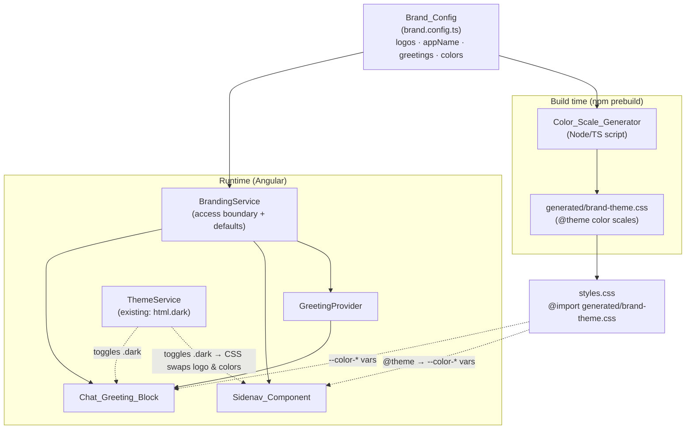

# Design Document

## Overview

This feature centralizes every rebrandable value in the AgentCore Public Stack Angular frontend into a single, documented source of truth — the `Brand_Config` — and routes all consumption of those values through one access boundary. A `Forker` rebrands the application by (a) replacing a documented pair of logo files and (b) editing hex colors, the app name, and greeting text in one file. From the three brand hex values, the full 11-step Tailwind color scales regenerate automatically.

The design has three consumption paths that share the same `Brand_Config`:

1. **Build-time color generation.** A `Color_Scale_Generator` reads the three `Brand_Color` values and emits the Tailwind `@theme` color-scale declarations (the `--color-{role}-{step}` custom properties) into a generated CSS partial that `styles.css` imports. Tailwind processes `@theme` at build time, so colors cannot come from a runtime service today.
2. **Runtime branding access.** A `BrandingService` (Angular `providedIn: 'root'`) exposes logo references, the app name, and greeting arrays as the single access boundary. Components read from this service, never from `Brand_Config` directly or from hardcoded literals.
3. **Runtime greeting rendering.** A `GreetingProvider` selects and renders a greeting, handling `{name}` substitution and the fallback chain.

### Key design decisions

- **Preserve the existing color mechanism exactly.** The current `@theme` block derives each non-500 step with CSS relative color: `oklch(from #hex calc(l ± delta) c h)`. This holds chroma (`c`) and hue (`h`) literally and adjusts only lightness (`l`), which is precisely what Requirement 5.3 asks for. The `Color_Scale_Generator` emits this same expression per step. With the `Default_Branding` hexes, the generated output is character-for-character identical to today's committed `@theme` block (Requirement 7.2), because the only inputs are the three hex literals and a fixed delta table.
- **`Brand_Config` is a TypeScript module.** A `.ts` module can be imported by both the Node build script (the generator) and the Angular runtime (the service), giving one physical source of truth for all four value groups. This also keeps the shape forward-compatible with a future runtime writer ("Option 2"): the same named fields, and colors expressed as single hex inputs, are exactly what a runtime writer would populate.
- **Keep CSS-only theme-aware logo switching.** Today both logo `` elements are always in the DOM and toggled by Tailwind's `dark:hidden` / `hidden dark:block` under the `html.dark` class that `ThemeService` maintains. This is instant, needs no page reload, and requires no JavaScript branch. The design keeps this structure and only sources `src`/`alt` from the `BrandingService`, preserving byte-identical rendering (Requirement 7.1) and sub-second switching (Requirement 2.6).
- **Access boundary applies defaults defensively.** Every field read through the `BrandingService` is normalized: missing/empty/invalid values fall back to the `Default_Branding` value for that field and surface an error indication, so every consuming component always receives a usable value (Requirements 7.5, 8.4, 8.5).

### Scope boundaries

This is a build-time / deploy-time foundation only. No admin UI, no backend persistence, no runtime logo uploads, and no runtime color/branding overrides are in scope (Requirement 9). The configuration shape is designed so a future "Option 2" runtime writer can reuse it without rework.

## Architecture



### Two clocks: build time vs runtime

| Concern | When resolved | Mechanism |
| --- | --- | --- |
| Brand colors → 11-step scales | Build time | `Color_Scale_Generator` emits `@theme` CSS partial; Tailwind compiles it |
| Light/dark color selection | Runtime (CSS) | `@theme` + `dark:` variants; `ThemeService` toggles `html.dark` |
| Logo `src` / `alt` | Runtime | `BrandingService` provides values; template binds them |
| Light/dark logo selection | Runtime (CSS) | Both `` present; `dark:hidden` / `hidden dark:block` |
| Greeting text | Runtime | `GreetingProvider` selects + substitutes `{name}` |

### Build integration

The `Color_Scale_Generator` runs as a `prebuild` / `prestart` npm script (before `ng build` / `ng serve`), reading `brand.config.ts` and writing `src/styles/generated/brand-theme.css`. `styles.css` imports that partial. The generated file is committed so a clean checkout renders correctly and diffs are reviewable; regeneration is deterministic, so committing it does not create churn unless a `Brand_Color` actually changed.

## Components and Interfaces

### Brand_Config (`src/branding/brand.config.ts`)

The single source of truth. A plain exported constant conforming to the `BrandConfig` interface. This is the only file a `Forker` edits for non-logo values.

### BrandingService (`src/branding/branding.service.ts`)

The single runtime access boundary (Requirement 8.2). `providedIn: 'root'`. Reads `Brand_Config` once, validates/normalizes each field against defaults, and exposes read-only accessors. It never throws on bad config; it substitutes defaults and records error indications.

```typescript
@Injectable({ providedIn: 'root' })
export class BrandingService {
  /** Normalized, always-usable logo asset references. */
  readonly logo: { light: string; dark: string };
  /** Normalized app name (falls back to a non-empty default label). */
  readonly appName: string;
  /** Normalized greeting template list (>= 1 entry, or empty if none valid). */
  readonly greetingTemplates: readonly string[];
  /** Normalized fallback greeting list (>= 1 entry, or empty if none valid). */
  readonly fallbackGreetings: readonly string[];
  /** Non-fatal problems found while reading Brand_Config (for surfacing/logging). */
  readonly configErrors: readonly BrandConfigError[];
}
```

### GreetingProvider (`src/branding/greeting.provider.ts`)

Encapsulates greeting selection and `{name}` substitution. Consumed by `session.page.ts` (replacing the hardcoded arrays and the `computed` greeting) and reused by any other empty-state greeting.

```typescript
@Injectable({ providedIn: 'root' })
export class GreetingProvider {
  /**
   * Resolve the greeting string to display.
   * @param firstName current user's first name, possibly null/blank
   */
  resolveGreeting(firstName: string | null | undefined): string;
}
```

Selection rule (deterministic given a chosen index; a random index is chosen once per session to match current behavior):

1. If `firstName` has at least one non-whitespace character AND `greetingTemplates` is non-empty → pick a template, replace **every** `{name}` occurrence with `firstName` (using `replaceAll`, fixing today's first-only `.replace`). (R4.3, R4.5)
2. Else if `fallbackGreetings` is non-empty → return a fallback entry. (R1.7, R4.4, R4.7)
3. Else → return the built-in `DEFAULT_GREETING` constant, which contains no `{name}`. (R4.8)

### Color_Scale_Generator (`scripts/branding/generate-brand-theme.ts`)

A Node/TypeScript build script. Pure transformation from three hex strings to a CSS string.

```typescript
/** The 11 Tailwind steps in order. */
const STEPS = [50, 100, 200, 300, 400, 500, 600, 700, 800, 900, 950] as const;

/** Fixed lightness deltas applied via oklch(from #hex calc(l + delta) c h).
 *  step 500 is the literal hex (delta 0, emitted as the hex itself). */
const LIGHTNESS_DELTA: Record<number, number> = {
  50: 0.4, 100: 0.35, 200: 0.3, 300: 0.2, 400: 0.1,
  500: 0,
  600: -0.1, 700: -0.15, 800: -0.2, 900: -0.25, 950: -0.3,
};

/** Produce the 11 CSS declarations for one role. */
function generateScale(role: 'primary' | 'secondary' | 'tertiary', hex: string): string;

/** Produce the full @theme color block for all three roles. */
function generateBrandTheme(config: BrandConfig): { css: string; errors: BrandConfigError[] };
```

For each non-500 step it emits `--color-{role}-{step}: oklch(from {hex} calc(l {+|-} {|delta|}) c h);`. For step 500 it emits `--color-{role}-500: {hex};`. Invalid hexes are rejected and the role falls back to the `Default_Branding` hex, with an error recorded (R5.7, R8.5).

### Sidenav_Component & Chat_Greeting_Block (template changes)

Both keep the dual-`` CSS-swap structure and bind `src`/`alt` from `BrandingService`, plus an `(error)` handler for missing assets:

```html


```

`onLogoError` marks the image as failed and reveals a same-dimension placeholder with a visible "logo failed to load" indication, without collapsing layout or blocking surrounding content (R2.8).

## Data Models

### BrandConfig

```typescript
/** A 6-digit hex color input, with optional leading '#'. Validated at read time. */
export type HexColorInput = string;

export interface BrandLogoAssets {
  /** Documented path to the light-theme logo (served from /public). */
  light: string;
  /** Documented path to the dark-theme logo (served from /public). */
  dark: string;
}

export interface BrandColors {
  primary: HexColorInput;   // Default_Branding: #0033a0
  secondary: HexColorInput; // Default_Branding: #d64309
  tertiary: HexColorInput;  // Default_Branding: #0072ce
}

export interface BrandConfig {
  /** Light/dark logo file references (Requirement 2.1). */
  logo: BrandLogoAssets;
  /** App name / logo alt text, 1–100 chars, >=1 non-whitespace (Requirement 3.1). */
  appName: string;
  /** Ordered greeting templates, 1–50 entries, each 1–500 chars (Requirement 4.1). */
  greetingTemplates: string[];
  /** Ordered fallback greetings, 1–50 entries, each 1–500 chars (Requirement 4.2). */
  fallbackGreetings: string[];
  /** Brand colors as single hex inputs (Requirement 5.1, 8.3). */
  colors: BrandColors;
}
```

Each field is one distinct named slot (Requirement 8.1), and every color role is a single hex input a future runtime writer could supply (Requirement 8.3).

### BrandConfigError

```typescript
export interface BrandConfigError {
  /** Which field was invalid, e.g. 'colors.primary', 'appName'. */
  field: string;
  /** The offending value (for surfacing/identification), if representable. */
  value?: string;
  /** Human-readable reason. */
  reason: string;
}
```

### Default_Branding constants (`src/branding/brand.defaults.ts`)

Frozen constants capturing today's shipped values, used as fallbacks by the access boundary and the generator:

- `DEFAULT_LOGO = { light: 'img/logo-light.png', dark: 'img/logo-dark.png' }`
- `DEFAULT_APP_NAME = 'Boise State University Logo'`
- `DEFAULT_ALT_LABEL = 'Logo'` (the non-empty default alt when `appName` is blank — R3.5)
- `DEFAULT_GREETING_TEMPLATES` / `DEFAULT_FALLBACK_GREETINGS` = the exact arrays currently in `session.page.ts`
- `DEFAULT_GREETING = 'How can I help you today?'` (built-in ultimate fallback, no `{name}` — R4.8)
- `DEFAULT_COLORS = { primary: '#0033a0', secondary: '#d64309', tertiary: '#0072ce' }`

### Validation rules (applied at the access boundary and by the generator)

| Field | Rule | On failure |
| --- | --- | --- |
| `colors.{role}` | matches `/^#?[0-9a-fA-F]{6}$/` | use default hex for role, record error (R5.7, R8.5) |
| `appName` | 1–100 chars, ≥1 non-whitespace | use `DEFAULT_ALT_LABEL`, record error (R3.5) |
| `logo.{light,dark}` | non-empty string path | use default path, record error |
| `greetingTemplates` | array, 1–50 entries, each 1–500 chars | drop invalid entries; if none valid, treat as empty → fallback chain (R4.7) |
| `fallbackGreetings` | array, 1–50 entries, each 1–500 chars | drop invalid entries; if none valid → built-in default (R4.8) |
| whole config | importable/parseable | render with `Default_Branding`, record error (R7.5) |

## Correctness Properties

*A property is a characteristic or behavior that should hold true across all valid executions of a system — essentially, a formal statement about what the system should do. Properties serve as the bridge between human-readable specifications and machine-verifiable correctness guarantees.*

The two pure cores of this feature — the `Color_Scale_Generator` (hex → CSS scale) and the `GreetingProvider` / access-boundary normalization (config + name → usable value) — are well suited to property-based testing. UI wiring, CSS-driven theme switching, byte-identical regression checks, and documentation are covered by example, snapshot, and edge-case tests in the Testing Strategy instead.

### Property 1: Color scale structure

*For any* valid 6-digit `Brand_Color` hex and role, the generated scale contains exactly 11 declarations named `--color-{role}-{step}` for steps `50, 100, 200, 300, 400, 500, 600, 700, 800, 900, 950` in that order, and the step-500 declaration is the literal input hex, unchanged.

**Validates: Requirements 5.2, 5.4**

### Property 2: Lightness derivation holds chroma and hue

*For any* valid 6-digit `Brand_Color` hex, every non-500 step is emitted as `oklch(from {hex} calc(l {±delta}) c h)` — holding chroma (`c`) and hue (`h`) equal to the input — and the applied lightness offsets are strictly decreasing from step 50 to step 950, so steps 50–400 are lighter than 500 (positive offset) and steps 600–950 are darker than 500 (negative offset).

**Validates: Requirements 5.3**

### Property 3: Generator determinism

*For any* valid `Brand_Config`, generating the brand theme twice produces character-for-character identical CSS, and changing a single role's hex changes only that role's declarations, leaving the other two roles' declarations unchanged.

**Validates: Requirements 5.5**

### Property 4: Invalid hex rejection

*For any* color-role value that is not a valid 6-digit hexadecimal input (with or without a leading `#`), the system rejects the value, uses the `Default_Branding` hex for that role, and records an error indication that identifies both the offending value and the role.

**Validates: Requirements 5.7, 8.5**

### Property 5: Config normalization supplies usable defaults

*For any* `Brand_Config` in which any field is absent, empty, out of bounds, or otherwise invalid (including an absent or unparseable config entirely), every value read through the `BrandingService` access boundary is a usable value — the valid provided value when acceptable, otherwise the defined `Default_Branding` value for that field — and an error indication is recorded for each defaulted field.

**Validates: Requirements 3.1, 4.1, 4.2, 7.5, 8.4**

### Property 6: Named greeting substitution

*For any* first name containing at least one non-whitespace character and any non-empty template list, the resolved greeting is one of the configured templates with every `{name}` occurrence replaced by the first name, and the result contains no remaining `{name}` placeholder.

**Validates: Requirements 4.3, 4.5**

### Property 7: Fallback greeting selection

*For any* resolution where the first name is absent, null, empty, or whitespace-only, or where the template list is empty or unreadable, the resolved greeting is a member of the configured fallback list (when that list is non-empty).

**Validates: Requirements 1.7, 4.4, 4.7, 7.4**

### Property 8: Ultimate default greeting

*For any* resolution where both the template list and the fallback list are empty or undefined, the resolved greeting equals the built-in default greeting and contains no `{name}` placeholder.

**Validates: Requirements 4.8**

### Property 9: Logo alt text equals normalized app name

*For any* `App_Name` value, every branding logo image rendered by the `Sidenav_Component` and the `Chat_Greeting_Block` has identical alt text equal to the normalized app name — the `App_Name` when it is valid, and a fixed non-empty default label when the `App_Name` is absent or whitespace-only.

**Validates: Requirements 3.2, 3.3, 3.4, 3.5**

## Error Handling

All error handling is non-blocking: branding problems degrade to `Default_Branding` and surface an indication, never halting application render (Requirements 2.8, 5.7, 7.5, 8.4, 8.5).

| Failure | Detection | Response | Requirement |
| --- | --- | --- | --- |
| Invalid `Brand_Color` hex | Regex `/^#?[0-9a-fA-F]{6}$/` at generation and read time | Use default hex for that role; record `BrandConfigError{ field: 'colors.{role}', value, reason }`; build logs a warning | 5.7, 8.5 |
| Blank/oversized `appName` | Length + non-whitespace check | Use `DEFAULT_ALT_LABEL` for alt text; record error | 3.5, 8.4 |
| Missing/empty logo path | Empty-string check | Use default path; record error | 8.4 |
| Logo file absent / fails to load | `` `(error)` event | Reveal same-dimension placeholder with visible "logo failed to load" indication; keep surrounding content rendered | 2.8 |
| Empty/invalid `greetingTemplates` | Array validation, entry bounds | Drop invalid entries; if none valid, fall through to fallbacks | 1.7, 4.7 |
| Empty/invalid `fallbackGreetings` | Array validation, entry bounds | Drop invalid entries; if none valid, use built-in `DEFAULT_GREETING` | 4.8 |
| Absent/empty/unparseable `Brand_Config` | Import guard / shape check in `BrandingService` | Render with full `Default_Branding`; record error | 7.5 |

The `BrandingService` exposes `configErrors` so a developer-visible surface (console warning at minimum, and an optional dev-mode banner) can report rejected values without affecting end users.

## Testing Strategy

### Dual approach

- **Property-based tests** verify the universal properties above across many generated inputs — the `Color_Scale_Generator` and the `GreetingProvider`/normalization logic.
- **Unit / example tests** verify specific wiring, edge cases, and error handling.
- **Snapshot / golden tests** verify byte- and character-level regression against the current appearance.

### Property-based testing

- **Library:** `fast-check` with Vitest (the frontend's existing test runner). Do not hand-roll generators or a PBT harness.
- **Iterations:** minimum 100 per property.
- **Tagging:** each property test is tagged with a comment of the form
  `// Feature: branding-customization, Property {number}: {property text}`.
- **Generators:**
  - Valid hex: 6 hex digits, optional `#`, mixed case (covers R8.3 case-insensitivity and optional prefix).
  - Invalid hex: wrong length, non-hex chars, empty, `null`/`undefined`.
  - App name: arbitrary strings including empty, whitespace-only, 1-char, 100-char, 101-char, and unicode.
  - Names: arbitrary strings including `null`, `undefined`, empty, whitespace-only, and names containing `{name}`.
  - Templates/fallbacks: arrays from empty up to >50 entries, entries from empty to >500 chars, templates with 0..N `{name}` occurrences.
- **Mapping:** Property 1–4 → `Color_Scale_Generator`; Property 5 → `BrandingService` normalization; Property 6–8 → `GreetingProvider`; Property 9 → rendered `Sidenav`/`Chat_Greeting_Block` via component tests driven by generated app names.

### Example & edge-case unit tests

- Components read logo `src`/`alt` from `BrandingService`, not literals (R1.3, R2.2, R2.3, R4.6, R8.2).
- Theme toggle swaps the visible logo via the `dark:` CSS classes with no navigation/reload (R2.4, R2.5, R2.6, R7.3).
- Logo `(error)` handler renders the same-dimension placeholder and keeps surrounding content (R2.8).
- Shape assertions that `Brand_Config` exposes every named field (R1.1, R1.2, R2.1, R8.1).

### Snapshot / golden regression tests

- **Colors (R7.2):** run the generator with the `Default_Branding` hexes and assert the output equals the current committed `@theme` color block, character-for-character. This is the guard that centralizing colors does not change any pixel.
- **Logos (R7.1):** assert default logo paths equal the current paths (`img/logo-light.png`, `img/logo-dark.png`).
- **Greetings (R7.4):** assert `DEFAULT_GREETING_TEMPLATES` / `DEFAULT_FALLBACK_GREETINGS` equal the arrays currently in `session.page.ts`.

### Documentation verification

- A checklist review confirms the `Rebranding_Documentation` covers logo swap steps + paths, per-value edit steps, the single-location statement, `{name}` behavior, hex-regeneration behavior, and verification steps (R6.1–R6.6).
- A doc-presence test asserts a heading containing "Non-Goals" exists and each deferred capability (admin UI / "Option 2", backend persistence, runtime logo uploads, runtime color/branding overrides) is stated (R9.1–R9.5).
