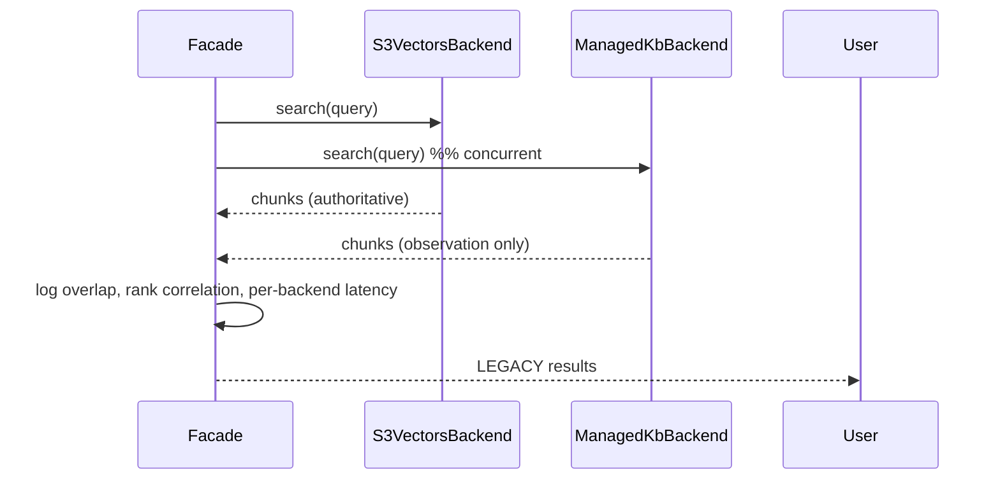
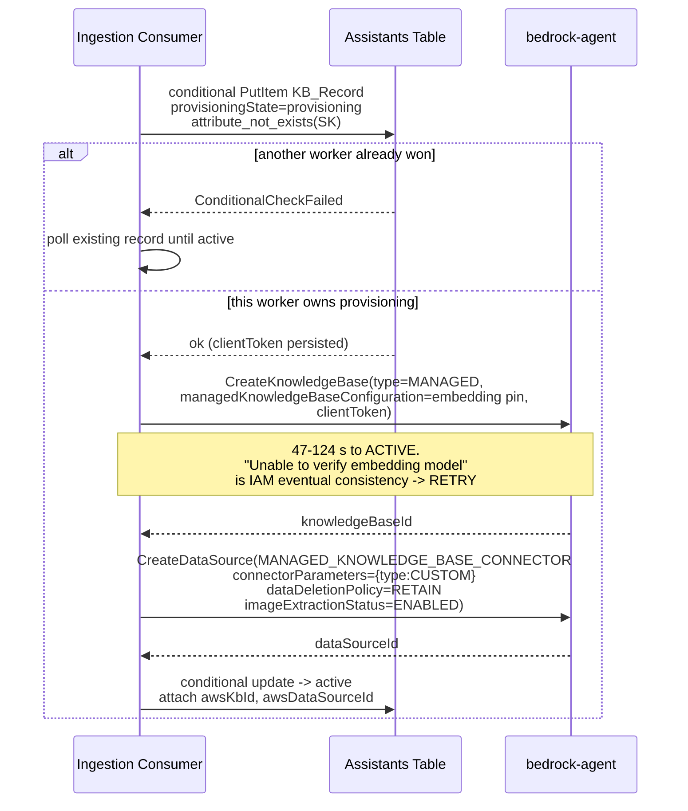
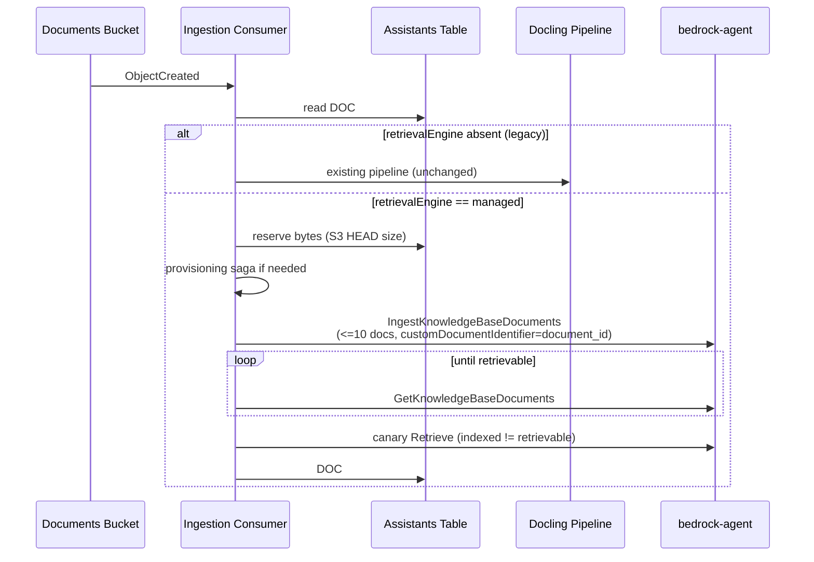
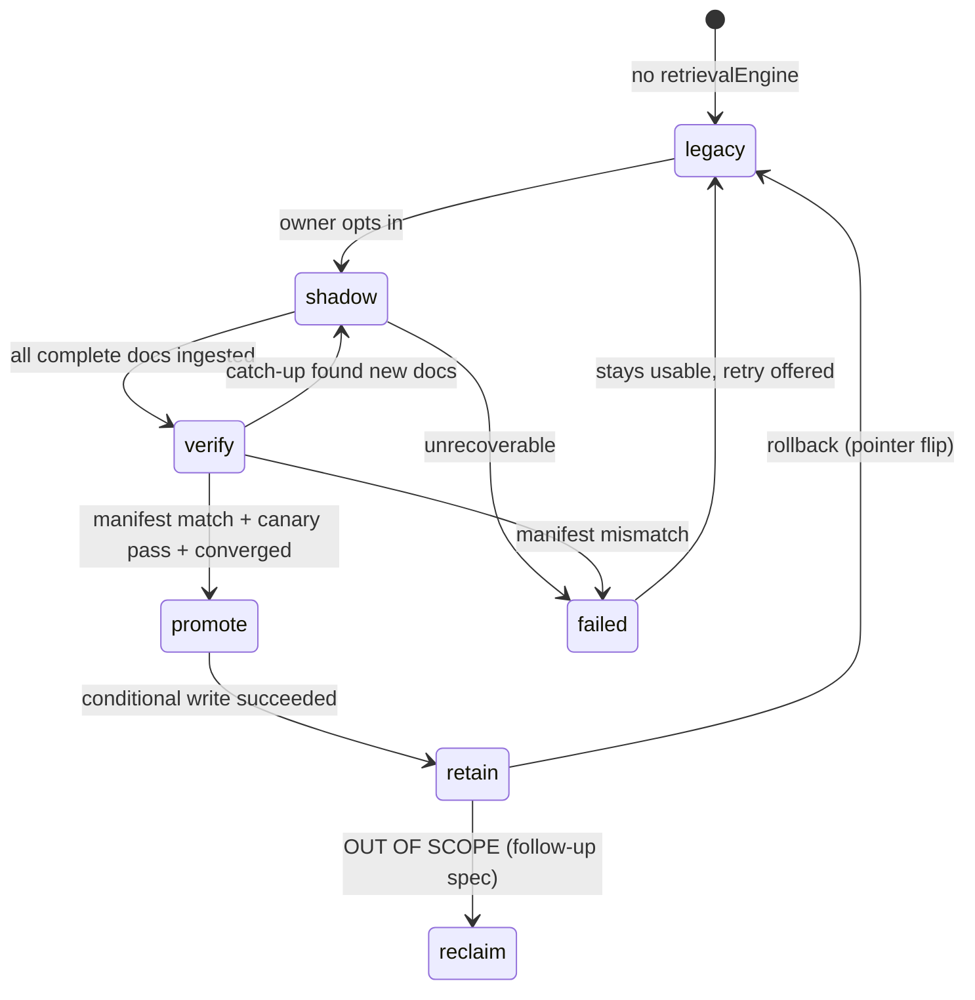

# Design Document: Managed Knowledge Base Migration

## Overview

This design replaces the custom RAG retrieval backend (Docling → Titan →
Amazon S3 Vectors) with **Amazon Bedrock Managed Knowledge Base**, one knowledge
base at a time, behind a single abstraction seam, with rollback available at every
step.

> **READ `HANDOFF.md` FIRST for current state.** This document is the design as
> intended. Sixteen defects were found only by *running* it, and several of them
> were caused by figures and claims in this document being applied to situations
> they did not describe — the inline ⚠️ notes mark the ones known to have misled.
> `HANDOFF.md` §5 carries the measurements that superseded them, and §6 carries
> what is still open. Where the two disagree, HANDOFF.md is the newer evidence.

The shape of the change is a **strangler fig**. There are exactly two retrieval
call sites today, both routed through
`search_assistant_knowledgebase_with_formatting`. That function becomes a thin
facade over a `KnowledgeBaseBackend` protocol with two implementations. A
per-knowledge-base discriminator selects which one runs. Nothing above the seam
learns which backend it received.

Three properties are load-bearing and everything else follows from them:

1. **Absence is the default.** A knowledge base with no `retrievalEngine`
   attribute is a legacy knowledge base. No backfill write is ever required, so a
   half-finished rollout cannot half-break the fleet.
2. **The expensive resource is created late and deleted through a tombstone.**
   Provisioning is lazy and idempotent; deletion writes a durable marker before it
   calls AWS.
3. **Promotion is a single conditional write, and legacy data survives it.**
   That makes rollback a pointer flip rather than a data restoration.

### What is deliberately not here

Phases 5–8 of the evaluation's §14.7 (managed-by-default, stopping legacy writes,
reclaiming legacy vectors, removing the old pipeline), agentic retrieval, any
change to the 2,000-character context cap, and the 1:1 → 0..N binding change (F4).
See `requirements.md` § "Scope boundary" and § "Non-goals".

---

## Guiding measured constraints

Every number here is measured in the evaluation, not assumed. They are collected
in one place because they are the reason the design has the shape it does.

| Constraint | Measured value | Design consequence |
|---|---|---|
| `CreateKnowledgeBase` → ACTIVE | 47–124 s (n=7, median ≈73 s) | Never on an interactive path; lazy provisioning with generous timeouts |
| Per-KB cold first ingest | ~68 s, remarkably constant (68.296/68.232/68.334 s) | A fixed cost of the *knowledge base*, not the document; pay it once, in background |
| Warm ingest, small text | ~2.5 s | Comparable to today; bulk migration is feasible |
| Warm ingest, 50 KiB PDF | 68–264 s | Long tail; ingestion timeouts ≥300 s, treated as background work |
| INDEXED → actually retrievable | 0.75–1.03 s | Two distinct timestamps. ⚠️ This is the gap AFTER indexing finishes — NOT a budget for `ingest → retrievable`, which is 37–264 s for PDFs (evaluation §5.1) and reached 5 m 30 s in dev. Sizing a wait from this number caused §5.30 and §5.37. Poll Bedrock's document STATUS first, then confirm retrievability with a `document_id`-filtered query |
| `Retrieve` p50 / p95 | 662–695 ms / 762–800 ms | +405 ms p50, +538 ms p95 vs today; acceptable but real TTFT cost |
| `StartIngestionJob` | 0.1 RPS, account-wide, **not adjustable** | Direct ingestion only; never per-document sync jobs |
| `IngestKnowledgeBaseDocuments` | **10 documents max**, server-enforced | Batch at 10, not the 25 the user guide claims |
| Concurrent Ingest+Delete document ops | 10 per account | Fleet migration throughput ceiling ~2 docs/s |
| `Retrieve` query input | 10,000 chars, **not adjustable** | Hard clamp at the seam |
| `Retrieve` RPM per KB | 600 + 25 RPS burst | Safe; per-KB isolation is the main quota win |
| `AgenticRetrieveStream` RPM | **60 per account** | Agentic retrieval cannot be a default path — out of scope |
| Managed storage | $5.00/GB-month | 35× today; byte caps are mandatory, not optional |
| Retrieval | $0.001/query | 2.3% of a $0.044 turn |
| Empty/idle KB | $0.00000203 measured for the month | No per-KB floor; count pressure is near zero |
| KB deletion | 2–6 minutes, async | Poll `ListKnowledgeBases`; "accepted" ≠ "gone" |
| Filter operators | fail **closed** (measured 0 results) | A mistyped filter yields nothing rather than leaking — but see the isolation note below |
| Managed reranking | separates scores 0.89/0.38/0.25/0.21/0.19 vs flat 1.00/0.84/0.78/0.77/0.77 | ⚠️ The separation is real, but the cap is NOT defensible on the managed path as built: Bedrock's chunks are ~3× Docling's, so only ~1 chunk clears 2,000 characters and four of reranking's five results never reach the model. Measured, with a wrong answer to show for it — HANDOFF.md §5.40 |

---

## Architecture

### The seam

```
                inference_api/chat/routes.py      app_api/assistants/routes.py
                              │                              │
                              └──────────────┬───────────────┘
                                             ▼
                     search_assistant_knowledgebase_with_formatting()
                          (facade — unchanged public signature)
                                             │
                          ┌──────────────────┴──────────────────┐
                          │   resolve_backend(app_kb_id)        │
                          │   reads KB_Record.retrievalEngine   │
                          │   absent ⇒ "s3vectors"              │
                          └──────────────────┬──────────────────┘
                                             ▼
                              KnowledgeBaseBackend (Protocol)
                                             │
                     ┌───────────────────────┴───────────────────────┐
                     ▼                                               ▼
            S3VectorsBackend                                 ManagedKbBackend
      (today's code, moved verbatim,               (bedrock-agent + agent-runtime,
       distance → relevance conversion)             managedSearchConfiguration)
                     │                                               │
              S3 Vectors index                                  Managed KB
```

New Python package: `backend/src/apis/shared/kb_backend/`

| Module | Responsibility |
|---|---|
| `protocol.py` | `KnowledgeBaseBackend` Protocol, `Chunk` dataclass |
| `resolver.py` | `retrievalEngine` → backend instance; absence defaults to legacy |
| `s3vectors_backend.py` | Legacy adapter; owns distance → relevance conversion |
| `managed_backend.py` | Managed adapter; owns `managedSearchConfiguration` |
| `query_guard.py` | 10,000-character clamp + truncation metric |
| `records.py` | KB_Record read/write, conditional transitions |
| `provisioning.py` | The provisioning saga |
| `byte_cap.py` | reserve / commit / release |
| `tombstones.py` | Durable delete markers |

> **Why a top-level package under `shared/`, not under `shared/assistants/`.**
> `kb_sync/records.py` documents that importing `apis.shared.assistants` "drags in
> the embeddings stack", which is why the kb-sync Lambdas use raw table access
> instead. The migration and ingestion Lambdas have that same constraint. Nesting
> the seam inside `assistants/` would force them to trip the very import the
> existing code goes out of its way to avoid. A sibling package keeps
> `apis.shared.kb_backend` importable by both the APIs and the Lambdas.
>
> Two rules make that hold rather than merely intend it:
> 1. `kb_backend/__init__.py` stays **empty** — no re-exports.
> 2. Heavy dependencies (`boto3` clients, the embeddings module) are imported
>    **inside functions**, matching the existing convention in `kb_sync/records.py`.
>
> An architecture test asserts that `apis.shared.kb_backend` does not transitively
> import `apis.shared.assistants`, alongside the existing boundary tests in
> `backend/tests/architecture/`.

> `apis/shared/assistants/vector_search.py` currently exists as a zero-byte
> placeholder. It is unused and unimported; leave it alone rather than repurposing
> it, so the new package's boundaries are unambiguous.

### Component inventory

| Component | Type | New or changed | Notes |
|---|---|---|---|
| `kb_backend/` package | library | **new** | The seam |
| `search_assistant_knowledgebase_with_formatting` | function | changed | Becomes a facade; signature preserved |
| `_filter_vectors_by_document_status` | function | changed | Fail closed (Req 5) |
| Ingestion consumer | Lambda | **new** | Replaces orchestration role of the Docling Lambda for managed KBs |
| Existing Docling ingestion Lambda | Lambda | unchanged | Still authoritative for legacy KBs |
| Migration dispatcher | Lambda | **new** | Copies `kb-sync` dispatcher shape |
| Migration worker | Lambda | **new** | Shares one image with the dispatcher |
| Reconciler | Lambda | **new** | Daily, report-only initially |
| KB service role | IAM role | **new** | One role serves many KBs |
| KB_Record | DynamoDB items | **new** | In the existing assistants table |

### Why reuse the `kb-sync` topology

`infrastructure/lib/constructs/kb-sync/kb-sync-construct.ts` already implements
exactly the shape this feature needs, and `scheduled-runs-construct.ts` documents
itself as following it closely — so this is the third use of an established
in-repo pattern, not a new invention:

- two Docker Lambdas sharing **one** image (`backend/Dockerfile.kb-sync`);
- the platform-as-bootstrap pattern — CDK ships a byte-stable stub from
  `bootstrap-assets/`, the workflow ships the real image via
  `update-function-code`;
- SSM parameters publishing the generated function names so the deploy script can
  find them;
- an EventBridge `rate()` schedule into the dispatcher;
- a bounded per-tick dispatch limit (`KB_SYNC_DISPATCH_LIMIT`, default 20).

The migration Lambdas must also follow `kb_sync/records.py`'s **raw table access**
convention. That file exists for a documented reason: importing
`apis.shared.assistants` drags in the whole embeddings stack, and keeping the
Lambda image small is a deliberate constraint. The migration worker has the same
constraint and takes the same approach.

---

## Data model

All new items live in the **existing** assistants table
(`boisestateai-v2-rag-assistants`), preserving the adjacency-list convention.

### KB_Record

For this phase `App_KB_Id == assistant_id`, so the record is a sibling of
`METADATA` under the assistant's partition. This is exactly the compatible
phase-1 option §14.2 proposes, and it is what `compat.py` already anticipates:
its docstring states that when F4 lands `ref` "becomes a real KB id with no shape
change here".

```
PK = AST#{assistant_id}
SK = KB#{app_kb_id}          # app_kb_id == assistant_id in this phase
```

| Attribute | Type | Notes |
|---|---|---|
| `appKbId` | S | Stable identity. What bindings reference |
| `ownerUserId` | S | For byte accounting and cost attribution. Opaque id, never email/PII |
| `visibility` | S | Mirrors the assistant's visibility in this phase |
| `retrievalEngine` | S | `"managed"`. **Never written as `"s3vectors"`** |
| `provisioningState` | S | `provisioning` / `active` / `failed` / `deleting` |
| `awsKbId` | S | AWS `knowledgeBaseId`. Replaceable. Never in a binding |
| `awsDataSourceId` | S | The `CUSTOM` connector id |
| `embeddingModelId` | S | `amazon.titan-embed-text-v2:0`. **Immutable** |
| `embeddingDimensions` | N | 1024. **Immutable** |
| `parserConfig` | M | Managed-parser settings captured at creation, including `imageExtraction`. Recorded because §14.2 requires immutable choices be persisted, and because a corpus indexed without image extraction is not comparable to one indexed with it |
| `imageExtraction` | BOOL | Convenience mirror of `parserConfig.imageExtraction` for queries |
| `storedBytes` | N | Committed bytes, from S3 `HEAD` |
| `reservedBytes` | N | In-flight reservations |
| `lastRetrievedAt` | S | Throttled write, one winner per 24 h |
| `migrationState` | S | `shadow` / `verify` / `promote` / `retain` / `failed`, plus `reclaim` reserved but never entered in this phase |
| `migrationGeneration` | N | Increments per attempt; guards stale workers |
| `migrationLeaseUntil` | S | Worker lease expiry |
| `migrationProgress` | M | `{migrated, total, lastDocumentId}` |
| `migrationError` | S | Plain-language reason for the UI |
| `promotedAt` / `rolledBackAt` | S | Rollback observation window anchors |
| `retainUntil` | S | Earliest eligible reclaim time |
| `pinned` / `exemptFromReclaim` | BOOL | Lifecycle exemptions |
| `clientToken` | S | Persisted so a retry reuses it |

### Tombstone

```
PK = AST#{assistant_id}
SK = KBTOMB#{app_kb_id}          # whole-KB delete
SK = KBTOMB#{app_kb_id}#DOC#{document_id}   # document delete
```

Carries `intent`, `awsKbId`, `awsDataSourceId`, `createdAt`, `attempts`,
`lastError`. **No TTL** — a tombstone is cleared by confirmed deletion or it stays
as a work item. Letting TTL remove it would recreate the exact silent-leak class
this design exists to close.

### Sparse GSI for work discovery

Migration work is discovered through a **sparse** GSI: the key attributes are
written *only while the record is eligible*, so ineligible and pinned knowledge
bases are invisible to the scan **by physics** rather than by filter.

This is an established convention on this exact table, not a new idea. Three
existing indexes already work this way and say so in their own comments:
`DueSyncIndex` (GSI4, written only while a sync policy is `active`),
`AgentDirectoryIndex` (GSI5, written only while a listing is `published`), and
`AgentReportsIndex` (GSI6, written only while a report is `open`).

The table currently has **six** GSIs, named `GSI_PK`/`GSI_SK` for the first and
`GSI2_PK`/`GSI2_SK` through `GSI6_PK`/`GSI6_SK` thereafter. The new index is
therefore **GSI7**:

```
GSI: KbWorkIndex          (partition GSI7_PK, sort GSI7_SK, projection ALL)
  GSI7_PK = KBWORK#{state}          # e.g. KBWORK#shadow
  GSI7_SK = {dueAt ISO-8601}
```

When a knowledge base reaches a terminal state, the worker **removes** `GSI7_PK`
and `GSI7_SK`. A bug that fails to remove them causes repeated no-op work bounded
by the per-tick dispatch limit, not a runaway.

Following the `AgentDirectoryIndex` precedent, the generic assistant-update path
must list `GSI7_*` as immutable, so a routine edit can never resurrect a work key
on a knowledge base that has left the queue.

---

## Backend protocol

```python
# apis/shared/kb_backend/protocol.py
from dataclasses import dataclass
from typing import Any, Protocol

@dataclass(frozen=True)
class Chunk:
    text: str
    relevance: float          # canonical: HIGHER IS MORE RELEVANT
    document_id: str
    metadata: dict[str, Any]
    key: str

class KnowledgeBaseBackend(Protocol):
    async def search(self, kb_ref: str, query: str, top_k: int) -> list[Chunk]: ...
    async def ingest(self, kb_ref: str, document_id: str, source: "DocumentSource") -> None: ...
    async def delete_document(self, kb_ref: str, document_id: str) -> None: ...
```

### Score direction — the silent-failure risk

This is the single most dangerous detail in the migration, because getting it
wrong produces **no error, just worse answers**.

- S3 Vectors returns cosine **distance**: lower is better. The current formatted
  result dict literally has a `"distance"` key, and its docstring says
  *"lower = more similar"*.
- Managed KB returns **relevance**: higher is better. The probe measured
  `score: 1.0` on an exact hit.

The protocol canonicalizes on **relevance**. `S3VectorsBackend` performs the
conversion in its adapter, and `ManagedKbBackend` passes through. The facade keeps
emitting a `distance` key for any existing consumer during the transition, derived
from relevance, so no caller breaks on the field rename.

A test asserts that for the same ordered input both backends rank the known-best
chunk first (Req 2.4). Without it, an inversion is undetectable by any other test
in the suite.

### Query guard

```python
MAX_QUERY_CHARS = 10_000   # Managed KB Retrieve cap; NOT adjustable
```

Applied in the facade, before backend dispatch, so both backends are protected
identically. Truncation emits a metric and never raises. This replaces the
existing inline comment in `bedrock_embeddings.py` asserting that the query is a
"short string, no token validation needed" — which is true only because Titan v2
tolerates ~32,000 characters.

### Retrieval configuration

`ManagedKbBackend` sends `managedSearchConfiguration`, never
`vectorSearchConfiguration` — the latter is rejected outright for managed
knowledge bases:

```python
retrievalConfiguration = {
    "managedSearchConfiguration": {
        "numberOfResults": top_k,              # 5, parity
        "rerankingModelType": "MANAGED",       # NOT "NONE"
        # "filter": {...}  equals/in only for isolation-critical filters
    }
}
```

Hybrid search is not configurable for managed knowledge bases and is simply how
managed retrieval works; there is no toggle to set and none is attempted.

### The document-status filter runs on both backends

Requirement 3.3 keeps the `status == "complete"` post-filter on the managed path
too, even though managed ingestion makes it largely redundant — because removing it
in the same change that swaps the engine would confound the comparison. Parity
means parity, including the parts that look unnecessary.

This works on the managed path only because `customDocumentIdentifier` is set to
the platform's `document_id` (Requirement 9.4). The filter needs a `document_id`
per returned chunk; the 1:1 identifier mapping is what supplies it. Without that
mapping there would be nothing to join on, which is a second reason the `CUSTOM`
connector beats pointing a native S3 connector at the prefix.

The filter is applied in the facade, above the seam, so there is exactly one
implementation and it **fails closed** on both backends (Requirement 5). Its
removal from the managed path is a follow-up-spec decision, made only once managed
is the sole engine.

---

## Authorization, isolation, and publication

This section closes evaluation gate §14.3. It is the gate most easily mistaken for
already-solved, because Managed KB ships two features whose names suggest they do
more than they do.

### Three isolation levels, correctly ranked

| Level | Mechanism | What it actually guarantees |
|---|---|---|
| **Weakest** | Metadata filter (`equals`/`in`) | *Logical* separation only. AWS's own multi-tenant guidance calls this "filter-level (logical) isolation, **not** IAM-enforced (infrastructure) isolation" |
| **Middle** | ACL-aware retrieval | Fails closed, which is better than today's document-status filter — but AWS states plainly that it "is not authorization" and does not authenticate users. Identity is **email only, with no alias resolution, and mismatches fail silently** |
| **Strongest** | One knowledge base per boundary, plus a resource policy | Genuine IAM-enforced `bedrock:Retrieve` / `bedrock:GetDocumentContent` |

**Design consequence: the app remains the authorization authority.** Neither
metadata filters nor ACL-aware retrieval may be the sole thing standing between one
user's documents and another's. Because this phase keeps `App_KB_Id ==
assistant_id`, the per-assistant boundary *is* a per-knowledge-base boundary, which
is the strongest of the three by construction. Filters are used for sub-scoping
within a knowledge base, never as the tenant boundary.

The email-only identity limitation is why ACL-aware retrieval is **not** adopted in
this phase: this platform authenticates via OIDC with claim mappings, and a
silently-failing email match is a worse primitive than an explicit app-side check.

### Invocation-time access resolution

The runtime resolves the invoking user's access to a knowledge base **before**
retrieval, reusing the existing assistant permission model rather than inventing a
parallel one:

- **owner / editor** — may read, may upload, may trigger an upgrade.
- **viewer** — may read through the agent; never sees the upgrade control.
- **no access** — retrieval is not attempted.

Because this phase is 1:1, an agent's knowledge base is exactly the agent's own, so
"can this user invoke this agent" already answers "may this user's turn retrieve
from this knowledge base". A turn is never failed because of a knowledge base the
user cannot reach — there is no such case while the relationship stays 1:1. That
changes with F4, which is precisely why F4 is a separate spec: the "one
inaccessible knowledge base among N blocks the whole turn?" question only becomes
real then, and it is recorded here as inherited-open rather than answered
prematurely.

### Published agents and corpus drift

A marketplace listing freezes a knowledge base **reference**, not its contents, so
a published agent's answers can change after review without any re-review. This
phase does not solve that, and must not pretend to. It takes the one position that
is safe and reversible:

- Migration **does not change** what a published agent retrieves — parity is the
  whole contract, so an engine swap is not a corpus change and needs no re-review.
- A published agent is **exempt from lifecycle reclaim while listed**, and
  `taken_down` requires an explicit transition rather than falling through to
  reclaim.
- Whether published agents should pin a corpus revision, require re-review after
  content changes, or bind only publisher-managed knowledge bases is an **open
  question owned by the marketplace spec**, recorded in "Open questions carried
  forward". Exemption from cleanup alone does not close that review bypass, and this
  design does not claim it does.

### Resource policies

Resource policies are MANAGED-only and are the only mechanism here offering real
infrastructure isolation. This phase creates them only where a knowledge base is
shared beyond its owner. Because they attach to the **AWS knowledge base ARN**, any
cycle producing a new `awsKbId` silently drops sharing — so re-application after
rehydration is a tested invariant, not a runbook note.

---

## Dual-read pilot

The pilot exists so the rollout rests on evidence from *our* corpus and *our*
users, not solely on a 3-document benchmark.



Rules that make it safe to leave on:

- **Legacy is always what is served.** The managed result is observation only.
- **The managed call is fire-and-forget with respect to correctness.** A managed
  failure or timeout is logged and discarded; it can never fail the turn.
- **It must not add user-visible latency.** The two calls are concurrent and the
  response is returned as soon as legacy resolves, so the managed call's 662–695 ms
  p50 is not additive.
- **Opt-in per knowledge base, default off**, so pilot cost is bounded and
  deliberate.

Recorded per read: overlap in returned `document_id` values, rank correlation, and
per-backend latency. That is the same measure-first pattern used for the
prompt-cache and document-offload work.

---

## Provisioning saga

Ordering exists to guarantee that a crash leaves a **retry anchor**, never an
invisible paying resource.



Five details that are each a defect if omitted:

1. **DDB before AWS.** A crash after `CreateKnowledgeBase` leaves a
   `provisioning` record the Reconciler can match against the orphan, so the
   resource is adoptable rather than stranded.
2. **`clientToken` is built, not interpolated.** Minimum length is **33
   characters**; the natural `{id}-{variant}-kb` token is 31 and fails client-side
   validation. It is persisted on the record so a retry reuses the same token and
   AWS deduplicates.
3. **`dataDeletionPolicy: RETAIN` at creation.** This is the documented remedy for
   the `DELETE_UNSUCCESSFUL` state, and the dev account already contains a
   knowledge base stuck in it since 2025-11-24. Set it deliberately up front, not
   as incident response.
4. **`imageExtractionStatus: ENABLED`.** Opt-in. Left default, chart and image
   content is never described and never indexed — a silent loss of the capability
   being paid for.
5. **The embedding-model verification failure is retryable.** It was observed
   against a model confirmed `ACTIVE` and directly invokable. Treated as fatal, lazy
   provisioning fails intermittently while pointing at the wrong cause.

---

## Ingestion control plane

The browser creates an `uploading` `DOC#` row and receives a presigned S3 PUT.
**There is no upload-complete API call**, so the bucket's `ObjectCreated`
notification remains the only trigger. A durable consumer is therefore required —
not an in-process `asyncio.ensure_future` task.



- **Routing is exclusive.** A document is indexed on exactly one backend outside a
  deliberate migration or dual-read pilot, so no double-indexing.

  > **Implemented on both sides as of 2026-09-01, and it was not before.** The
  > ingestion consumer always stood down for a legacy document, but the legacy
  > pipeline had no engine gate at all and its S3 notification is still live, so
  > every document added to a promoted knowledge base was handled twice — and both
  > pipelines wrote `DOC#` status, so "ready" was decided by whichever finished
  > last. See HANDOFF.md §5.32 and §5.34. Deletion was the mirror gap: it removed
  > the legacy vectors and never touched the managed corpus (§5.36).
- **Two timestamps, not one.** `indexedAt` and `retrievableAt` are recorded
  separately, because they are genuinely distinct events.

  > ⚠️ **The figure that used to appear here — "the gap measured 0.75–1.03 s" — is
  > correct for `INDEXED → retrievable` and WRONG as a budget for anything else. It
  > caused two defects.** Both `verify` (§5.30) and the ingestion consumer (§5.37)
  > used it to size a wait that actually had to cover
  > `ingest → INDEXED → retrievable`, which the evaluation's §5.1 measured at
  > 37–264 s for PDFs and which reached **5 m 30 s** on a 1.5 MB file in dev. The
  > second occurrence happened because the first fix was applied to `verify` only
  > and nobody grepped for the constant's other homes.
  >
  > Two further corrections earned by measurement: `indexedAt` must be Bedrock's own
  > `updatedAt`, not local time after the ingest call returns — that call is
  > fire-and-forget, and recording local time made the field a fabrication that a
  > truthiness assertion could not catch. And retrievability must be confirmed with
  > a `document_id`-filtered retrieval; querying the id as free text cannot find its
  > own document once a knowledge base holds more than one (§5.38).
- **Timeouts ≥300 s.** A 50 KiB PDF has been observed at 264 s.
- **No chunk-key bookkeeping.** `customDocumentIdentifier = document_id` gives a
  1:1 mapping, which retires the whole `{doc_id}#{chunk_index}` scheme including
  `delete_vector_tail` and the chunk-shrinkage stash on the managed path.

---

## Migration state machine



`retain` is the terminal state this spec reaches. `reclaim` is present in the enum
so the follow-up spec adds a transition rather than a schema change, but nothing
here enters it.

| Phase | Work | Serving | User sees |
|---|---|---|---|
| `shadow` | Provision KB, re-ingest every `complete` doc from existing S3 keys | **legacy** | "Upgrading — 12 of 40 documents", fully usable |
| `verify` | Exact source manifest compare + canary retrieve | **legacy** | same |
| `promote` | Single conditional write `retrievalEngine="managed"` | managed | one-time success note |
| `retain` | Legacy vectors preserved ≥30 days | managed | nothing |
| `reclaim` | **Out of scope — follow-up spec.** The state exists in the enum and the machine reaches `retain` and stops | managed | nothing |

### Timing, recomputed from the revised measurements

The evaluation's §10.3 quoted "a 20-doc assistant ≈ 4 min; 100 docs ≈ 9.5 min",
but those totals were computed from the **superseded** §5 figures (85 s create,
~65 s first ingest, ~5 s each thereafter). Recomputed from §5.1's revised numbers:

| Corpus | Arithmetic | Total |
|---|---|---|
| 20 small text documents | 73 s + 68 s + 19 × 2.5 s | **~3 min** |
| 100 small text documents | 73 s + 68 s + 99 × 2.5 s | **~6.5 min** |
| 20 native layout PDFs (50 KiB class) | 73 s + 68 s + 19 × (68–264 s) | **~24–86 min** |
| 20 scanned PDFs (260 KiB class) | 73 s + 68 s + 19 × (37–58 s) | **~14–21 min** |

The two PDF rows are kept separate because the measurements come from two different
document classes and averaging them would invent a number: the 50 KiB *native*
PDF measured 68–264 s, while the 260 KiB *scanned* PDF measured 37–58 s. The larger
file was consistently faster, so size is not the predictor — content structure is.

⚠️ **The PDF rows are the ones to plan around, and they are absent from the
evaluation's own estimate.** Per-document parse time dominates everything else for a
PDF-heavy corpus — the same 50 KiB PDF took 68 s, 89 s, 99 s and 264 s across four
runs. Progress reporting must therefore be per-document rather than
time-estimated, because a credible ETA cannot be computed up front.

Fleet ceiling is ~2 documents/second given the 10-concurrent-document-operation
account limit — roughly 85 minutes for 10,000 documents, and that is a floor, not a
forecast, for the same reason.

### Verification is a manifest, not a count

Document-count parity would pass while content silently diverged. `verify`
compares an exact manifest of `document_id` + content hash or generation, then
performs at least one canary retrieval proving expected content comes back from
the managed side. Count parity alone is explicitly insufficient.

### Writes and deletes during migration

Coexistence is **converge-on-quiet**, not dual-write, so exactly one write path
stays authoritative until promotion:

1. Uploads keep flowing to legacy as today.
2. The worker snapshots the doc-id set and migrates it.
3. A catch-up pass picks up anything created since the snapshot.
4. Repeat until a pass finds nothing new — the same shape as the crawler's
   consecutive-miss rule. Warm ingest is ~2.5 s, so convergence is fast.
5. Every document's `DOC#` record is re-read **immediately before** ingesting it
   and skipped if it is gone or no longer `complete`. Without this re-read, a
   document deleted mid-migration resurrects in the new knowledge base.
6. Promotion is conditional on a converged pass, so two workers cannot both
   promote.

---

## Reconciler

Runs daily. Joins a paginated, tag-filtered `ListKnowledgeBases` against
KB_Records.

| Case | Action |
|---|---|
| AWS only | Orphan. Delete **only if the AWS-reported `createdAt` is >24 h old** |
| Record only | Stale pointer. Mark `vectorState: missing`, re-create on next ingest. **Never delete the record** — the documents are still valid |
| Both | Refresh `storedBytes` for quota accounting |
| Tombstone present | Retry the delete; escalate `DELETE_UNSUCCESSFUL` as an operator state |

**Age-gate on `createdAt`, not on discovery time.** A reconciler that was down for
a week would otherwise wake up and delete every in-flight create.

**Ships in report-only mode.** It logs what it would have deleted and deletes
nothing. It runs that way for weeks before being armed — the inverted flag
convention the evaluation calls for. The arming flag treats an **empty string as
off**, because the repo has been bitten by empty workflow variables before.

---

## Byte cap accounting

Storage is 35× more expensive per gigabyte than today. The existing 1 GB-per-user
file precedent, applied here at 30,000 users, is a **$150,000/month** exposure.
This is the only part of the design that can cause real financial damage.

```
reserve(owner, bytes)   → conditional update, fails if committed + reserved + bytes > cap
commit(owner, bytes)    → reserved -= bytes; stored += bytes
release(owner, bytes)   → reserved -= bytes          (on ingestion failure)
```

- Size comes from an **S3 `HEAD`** on the stored object, never from a
  client-reported value.
- Reserve is a **conditional** update, so two uploads racing the same remaining
  allowance cannot both win.
- The default per-owner cap is **lower** than 1 GB and resolves by role tier.
- `RawDataSize` is **not** used for enforcement: it returned 0 datapoints for a
  directly-ingested document over a 60-minute lookback, and the cause is
  unconfirmed. It may be used for reporting only.
- Cost-allocation tags are delayed reporting, not enforcement.

### Concrete defaults

The evaluation requires "a lower role-tier default" without naming one. Proposed,
and flagged as **requiring product sign-off before implementation**:

| Tier | Per-owner cap | Worst-case at 30,000 users |
|---|---|---|
| Standard user | **100 MB** | 3 TB → ~$15,000/mo |
| Elevated (opt-in, admin-granted) | **1 GB** | — |
| Per-knowledge-base ceiling | **500 MB** | bounds a single runaway corpus |
| The 1 GB precedent, for contrast | 1 GB for everyone | 30 TB → **~$150,000/mo** |

100 MB is ~88× the measured average of 1.13 MB per active user, so it is generous
in practice while cutting worst-case exposure 10×. Expected spend at full adoption
on measured behaviour remains ~$169/month; the gap between $169 expected and
$15,000 permitted is exactly why the alarms below are not optional.

### Enforcement points

The cap is checked at **every** path that can add bytes to a managed knowledge
base, not just interactive upload:

1. **Upload** — reserve before ingest, commit on success, release on failure.
2. **Migration re-ingest** — the migration worker reserves for the whole snapshot
   before entering `shadow`, and **fails the migration up front** rather than
   part-migrating a corpus that will not fit. A knowledge base that exceeds its
   owner's cap is surfaced as a plain-language failure with the option to request an
   elevated tier.
3. **Rehydration** (follow-up spec) — same reserve path.

Migration is the easy one to miss and the worst one to miss: it is the single
largest byte-adding operation in the system, and it is the one that runs
unattended.

### Account-level alarms

Per-owner caps bound one user. They do not bound the fleet, so gate §14.6 also
requires account-wide guards:

| Alarm | Threshold | Why |
|---|---|---|
| Total managed KB storage | configurable GB | The only thing standing between expected and permitted spend |
| Managed KB count | 80% of the 10,000 default quota | The quota is adjustable, but capacity requests take lead time |
| `AmazonBedrockAgentCore` Knowledge-Base usagetype daily cost | configurable USD | Catches a cost shape no per-owner cap anticipated |
| `KbOrphansFound` sustained non-zero | any | The delete saga is leaking |

Alarms use `TreatMissingData.NOT_BREACHING`, matching the posture of the existing
kb-sync, scheduled-runs, and prompt-cache observability constructs.

### Who consumes retrieval quota

Requirement 12.10 asks whether the knowledge base **owner** or the **invoking
user** consumes retrieval quota. Half the answer is a fact about AWS rather than a
choice, and it inverts the current model:

| | Today (S3 Vectors) | Managed KB |
|---|---|---|
| `Retrieve` throughput | 20 rps **account-wide** | 600/min + 25 rps burst, **per knowledge base** |

So the quota is consumed **per knowledge base**, which means the *owner's* knowledge
base absorbs the throughput of everyone who invokes their agent. The invoking user
does not carry a retrieval allowance of their own.

**Decision: the owner is the payer, and this is an improvement, not a compromise.**
Today a single hot assistant can exhaust a 20 rps account-wide ceiling and degrade
retrieval for every other user on the platform. Per-KB quotas make that blast radius
one agent instead of the fleet — noisy-neighbour containment we do not currently
have.

Consequences worth stating, because they follow from the decision rather than from
the implementation:

* A **published** agent is the case to watch. Its knowledge base is one partition
  serving an unbounded audience, so it is the only realistic way to approach
  600/min. Measured headroom is comfortable — ~26 requests/min average on a hot
  shared knowledge base against an allowance of 600, about 4% — but the ceiling is
  now per-agent and therefore reachable by a single popular agent in a way the
  account-wide limit never made obvious.
* Retrieval is billed at **$0.001/query** and that cost attaches to the account, not
  to a tenant. Attributing it per invoking user is a cost-reporting question, not a
  quota question, and is out of scope here.
* Byte caps are per **owner**, consistent with this: the owner controls the corpus,
  so the owner carries both its storage cost and its throughput ceiling.

No code enforces a per-user retrieval allowance, deliberately. Adding one would
invent a limit AWS does not impose and that the existing per-agent permission model
already bounds.

---

## IAM and encryption

One Bedrock service role serves many knowledge bases — verified: a second
knowledge base created against the first one's role reached ACTIVE normally.
10,000 knowledge bases do not require 10,000 roles.

| Control | Shape |
|---|---|
| Confused-deputy guard | `aws:SourceAccount` + `ArnLike` on `AWS:SourceArn` scoped to `knowledge-base/*` |
| PassRole | Caller's `iam:PassRole` conditioned on `iam:PassedToService` |
| S3 | Conditioned on `aws:ResourceAccount` |
| KMS | `serverSideEncryptionConfiguration.kmsKeyArn` where customer-managed keys are required |
| Separation | Provisioner/migrator CRUD, direct-ingestion, and inference `bedrock:Retrieve` scoped independently |
| Metrics (write) | `cloudwatch:PutMetricData` scoped to the non-reserved `{projectPrefix}/ManagedKb` namespace on the **calling identities only** — not the service role, which Bedrock assumes and which never publishes our metrics |
| Metrics (read) | `cloudwatch:GetMetricData` / `GetMetricStatistics` for Bedrock's own `AWS/Bedrock/KnowledgeBases` metrics |
| Async safety | Synchronous boto3 calls from async request paths run off the event loop |

Three notes worth encoding rather than rediscovering:

- **Metric publishing is best-effort and permission-gated.** Omit the
  `PutMetricData` grant and metrics silently vanish while requests keep
  succeeding. CDK assertions cover it.
- **The publish namespace must not begin with `AWS`.** CloudWatch reserves those
  for its own services — "You cannot specify a namespace that begins with AWS" —
  so `PutMetricData` scoped to `AWS/Bedrock/KnowledgeBases` authorizes nothing
  that can ever succeed: a grant that reads as correct and silently does nothing.
  Our own metrics (the table under Observability below) go to
  `{projectPrefix}/ManagedKb`; the prefix keeps two environments in one account
  from blending. Bedrock's `AWS/Bedrock/KnowledgeBases` metrics remain a **read**
  source via `GetMetricData` / `GetMetricStatistics` — reading a reserved
  namespace is fine, only writing is not. Do not "simplify" the two back into one
  namespace.
- **Managed embedding and managed reranking need no Bedrock model access at all.**
  Only `CUSTOM` does — and this design pins `CUSTOM` Titan v2 embeddings for
  continuity across an immutable choice, so the grant is required.

### Resource policies and rehydration

Resource policies are MANAGED-only and give genuine IAM-enforced sharing for
`bedrock:Retrieve` and `bedrock:GetDocumentContent`. They attach to the **AWS
knowledge base ARN**, so any cycle producing a new `awsKbId` silently drops
sharing. Re-application after rehydration is a tested invariant (Req 24.12), not a
runbook step.

### Teardown

Managed knowledge bases are runtime-created and are **not** CloudFormation
children. `scripts/teardown/destroy.sh` must list and delete only resources tagged
for the project and environment, **before** deleting their service role and the
platform stack. Ordering is not cosmetic: deleting the role while a knowledge base
is still `DELETING` is a plausible route into `DELETE_UNSUCCESSFUL`, and a role
cannot be deleted until its inline policies are removed.

---

## Observability

EMF metrics alongside the existing PromptCache metrics. All of the following are
**our own** metrics and publish to `{projectPrefix}/ManagedKb` — never to
`AWS/Bedrock/KnowledgeBases`, which is reserved and rejects writes:

| Metric | Why |
|---|---|
| `KbCount`, `KbStorageGB` | Leading indicators for the adjustable 10,000 cap and the storage curve; feed the alarms above |
| `KbIdleGB` | **Emitted for baseline only in this phase.** Nothing reclaims yet, but the follow-up spec needs historical idleness data to choose its eviction threshold, and that data cannot be backfilled |
| `KbOrphansFound` | **Sustained non-zero is the only signal the delete saga is leaking** |
| `KbQueryClamped` | Req 4 truncation rate |
| `KbStatusFilterFailClosed` | Req 5 — distinguishes a confirmed-empty result from an unconfirmable one |
| `KbMigration{Started,Promoted,Failed,RolledBack}` | Rollout health |
| `KbDualRead{Overlap,RankCorrelation,Latency}` | The pilot's whole output: how much the two engines agree, and what the managed one costs. Values rather than counts, and `KbDualReadLatency` is dimensioned per backend so the 662–695 ms vs 257 ms gap is measured on our own traffic rather than assumed from the benchmark |
| `KbDualReadFailed` | Managed-side failures during the pilot. Never user-facing — the turn was served from legacy before the comparison ran — but sustained non-zero says the engine is not ready |
| `KbByteCapRejected` | Whether the proposed 100 MB default is actually workable, before it hardens into policy |

`KbReclaimedGBPerDay` is deliberately **not** emitted: nothing reclaims in this
phase, and a metric that is structurally always zero trains operators to ignore it.
It arrives with the reclaim tier.

**Idleness** is `max(own lastRetrievedAt, max(lastUsedAt) over bound agents)` —
never retrieval alone, or an actively used agent's knowledge base is evicted
because its queries did not match. `lastRetrievedAt` uses the throttled
conditional write pattern (one winner per 24 h), never a write per retrieval.
Per-knowledge-base `Invocations` from `AWS/Bedrock/KnowledgeBases` is a cheaper
idleness signal and is preferred where it is sufficient. That is a **read** of
Bedrock's own namespace via `cloudwatch:GetMetricData` (Req 20.13), not a publish.

**Cost attribution filters on `usagetype`.** Managed KB bills under
`AmazonBedrockAgentCore`, so anything keyed on `AmazonBedrock` misses it entirely,
and anything keyed on service code alone blends it into the AgentCore Runtime
memory line that is already 73% of that bill.

---

## Flags and deployment choreography

**Three** independent flags, all defaulting to off, all treating an empty string as
off:

| Flag | Controls | This spec |
|---|---|---|
| `MANAGED_KB_NEW_DEFAULT` | new knowledge bases are created managed | ships **off** (phase 5) |
| `MANAGED_KB_MIGRATION_ENABLED` | the background migrator runs at all | ships **off**, enabled per-pilot |
| `MANAGED_KB_RECONCILER_ARMED` | the reconciler deletes, rather than only reporting | ships **off** — report-only for weeks first |

The third is the inverted-convention flag: the reconciler is *deployed* from day
one but *disarmed*, so its judgement can be reviewed against real data before it is
allowed to delete anything.

Deployment order is fixed by a hard rule: **backend code must never deploy before
the IAM and resources it requires.**

1. **Platform** — additive schema, sparse GSI, service role, IAM, Lambda shells,
   SSM parameters, teardown support. No behaviour change.
2. **Backend** — seam, both adapters, fail-closed filter, query clamp. All three
   flags off, so managed code is dark.
3. **Pilot** — opt-in dual read on selected knowledge bases, still serving legacy.
4. **Opt-in migration** — owner-initiated, with the rollback observation window.

Steps 5–8 of §14.7 are a follow-up spec. Because all three flags default off,
reaching
them is a configuration change rather than a code change.

---

## UX surfaces

| State | Surface |
|---|---|
| legacy, no action needed | **nothing** — no badge, no nag. A knowledge base that works needs no UI |
| upgrade available | Inline opt-in card: only benefits the §13 benchmark proved, expected duration, and "your knowledge base keeps working during the upgrade" |
| `shadow` / `verify` | Non-blocking progress ("Upgrading — 12 of 40 documents"); safe to navigate away |
| `promote` succeeded | One-time dismissible note. No permanent badge |
| failed | Plain-language reason + Retry. Stays on legacy, which keeps working. Never a dead end |

Gated on the existing `_require_edit_permission`; viewers never see the control.
The word "vector" never appears in user-facing copy. No silent auto-migration in
this phase.

**Admin surface:** knowledge bases filterable by engine, with stored bytes and
document counts, bulk migrate, and per-knowledge-base retry.

### Surfacing failed and stuck documents

Migration carries only `complete` documents. Measured against production, 200 of
1,692 `DOC#` records (11.8%) are not `complete`: 101 stuck `deleting`, 95
`failed`, 4 `uploading`. Silently dropping the 95 failures is correct for the
index and wrong for the user — those people believe their uploads worked. The
upgrade flow surfaces them and offers retry.

Two related messaging defects are in scope only to the extent of Req 21.4
(distinguishing an unsupported format from a processing failure). The underlying
`.txt` ingestion bug — the deployed Docling build has no plain-text input format
despite the repo and frontend both advertising support, so a user waits 56 s for a
generic failure — is a **separate pre-existing bug**, not fixed here.

---

## Testing strategy

Mirrors the house pattern in `reliable-document-deletion`: unit tests plus
`hypothesis` property tests for invariants, with AWS stubbed.

| Area | Approach |
|---|---|
| Adapter parity + score direction | Same input through both backends; assert identical ranking of a known-best chunk |
| Query clamp | Property: for any query length, output ≤10,000 chars and never raises |
| Fail-closed filter | Simulate table-level failure and missing table name; assert zero chunks |
| Byte cap races | Property: concurrent reserves never let committed total exceed the cap |
| Provisioning idempotency | Two concurrent first-ingests create exactly one KB |
| Crash after AWS create | Record left as a retry anchor; Reconciler adopts rather than duplicating |
| Reconciliation | Record-only and AWS-only cases; age-gate honours AWS `createdAt` |
| Migration interference | Upload and delete during migration; deleted doc never resurrects |
| Mixed deployment | Old and new code serving simultaneously; absent discriminator still resolves legacy |
| Resource policy rehydration | New `awsKbId` re-applies the policy |
| CDK assertions | IAM conditions from Req 20, including `PutMetricData` |
| Teardown | Only tagged resources deleted, and before the role |

Managed AWS APIs are **stubbed**, never called live, so the suite stays
hermetic and free.

---

## Open questions carried forward

These remain genuinely open and are recorded so they are not mistaken for
settled:

1. **Does a knowledge base go cold again after idleness?** In progress in the
   evaluation. If a cold penalty exists, owners must be warned before eviction,
   because rehydration pays the ~68 s cold-ingest cost. Affects the follow-up
   spec's reclaim tier more than this one.
2. **Is there an account-level ingestion-concurrency limit?** The quota page lists
   none. Probe with a many-knowledge-base backfill during the pilot before sizing a
   wide migration.
3. **Does `RawDataSize` ever publish for directly-ingested documents?** Unconfirmed.
   Until it does, byte accounting uses S3 `HEAD` (already the design).
4. **Native Google Drive connector vs the current AgentCore-Identity adapter.**
   Never investigated. May sidestep the vault principal-binding dead-end at the
   cost of moving token custody into Secrets Manager.
5. **`bedrock:GetDocumentContent` shape, size limits, and cost.** Relevant to
   whole-document tasks that chunk retrieval structurally cannot serve. Unverified.
