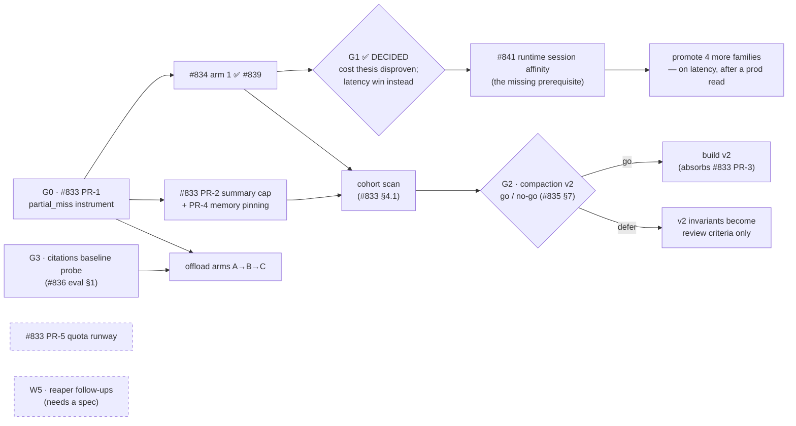

# Cost-Effectiveness Plan of Record

**For:** engineering · **Date:** August 5, 2026 · **Owner:** Phil Merrell
**Status:** living document — updated when a gate below is decided, a PR in the
arc merges, or a number moves. This is a *map*, not a fifth spec: each
workstream's authority lives in its own spec, and if this page disagrees with
a spec, the spec wins and this page gets fixed.

*Companion specs:* `compaction-over-threshold-cache-spiral.md` (#833) ·
`agent-cache-extra-tools-bypass.md` (#834) · `compaction-model-relative-thresholds.md` (2026-09-15) · `compaction-v2-versioned-prefix.md`
(#835) · `document-context-offload.md` + validation + evaluation (#836) ·
`quota-cooldown-windows.md` · `tool-search-token-bloat-strategy.md` ·
`session-workspace-tools.md` · `share-large-conversations-s3-offload.md` ·
`agentcore-evaluations-spike-findings.md` (2026-08-12 — what the managed
evaluation service does and does not do for the shared harness)

*Fleet measurement:* `fleet-prefix-spend-anatomy.md` (2026-08-05) — the flat,
all-conversations spend decomposition this page now ranks work against.

---

## The tenet, restated as a plan

CLAUDE.md's token-cost tenet says: engineer against **waste**, never against
context, and verify — don't guess. The 2026 investigations turned that tenet
into measured findings: attachment conversations are 31% of model spend,
cold prefix re-writes ~25%, and one compaction spiral spent 90% of a user's
monthly quota on cache re-writes. Meanwhile the AICC platform report found
**AgentCore Runtime memory is ~73% of the total AWS bill** — the model-token
arc below optimizes the *minority* of spend, and the plan has to hold both
levers in frame.

**Correction, 2026-08-05:** this paragraph previously read "the fleet writes 2×
what it reads from cache." That is inverted. The 2026-07-27 measurement was
write:read **1:2**, and the fleet scan confirms it (289.9M read / 186.4M
written = 0.64). §4.4's "target ≤ 1:4" only parses that way.

## The spend anatomy — every conversation, measured 2026-08-05

Each investigation so far entered through its own door and sized its own
cohort. `fleet-prefix-spend-anatomy.md` asks the flat question, and the answer
reorganizes this page: **55.2% of all model spend is cache *writes*.**

| component | share of $888.35 | the workstream that owns it |
|---|---|---|
| **cache write** | **55.2%** | W2 prefix stability (+ the new W2b below) |
| output | 19.8% | artifacts / edit-in-place (deferred in #833) |
| input (uncached) | 17.5% | W3 payload boundedness |
| cache read | 7.5% | — this is the *cheap* line; more of it is the goal |

Caching is still net-positive fleet-wide (a prefix breaks even after ~0.3
reads and the fleet reads 1.6× what it writes) — the target is fewer
**re**-writes, never fewer cachePoints. Two findings from that scan changed
how the backlog below is ranked:

- **The system prompt mutates mid-session in 12.3% of multi-turn
  conversations** (#833 D4 / PR-4). Filed as "small next to D2/D3" because it
  was ranked inside one incident; fleet-wide it is the most general defect in
  the epic and the cheapest to fix.
- **$383 of $888 — 43% — sits in conversations of 15 calls or fewer**, which
  nothing in this arc addresses. 700 sessions wrote cache and never read any
  back ($33.92, 7.3% of all write spend, returning nothing).

## North-star metrics (proposed — ratify at first review)

1. **Unexplained-waste share of model spend** = (partial-miss + avoidable-miss
   dollars, net of `agentSwitched` re-writes) ÷ total model spend. #833 PR-1
   built the instrument (`partial_miss` on every `C#` row,
   `PartialMiss`/`PartialMissUsd` EMF, `partialMissCount`/`partialMissUsd`
   session rollups). Provisional target: **< 5%**. This is the number that says
   the *prefix-stability* and *payload* work is done.
   **First reading: 5.9% ($52.14 of $888.35), 2026-08-05** — obtained by
   running the predicate *offline* over historical rows, so it does not clear
   G0 (that still needs a prod baseline week after #838 releases, and nothing
   is backfilled). It is a **floor**: immediate-predecessor comparison only,
   no fingerprints before #697, and 10.8% of call rows carry no cost at all.
   206 of the 215 rows it flags say `hit` today — which is the blind spot #838
   exists to close, now quantified rather than assumed.
2. **Cache-write share of model spend** (added 2026-08-05). The anatomy above
   makes this the single most legible number on the page: **55.2% today**.
   Unlike metric 1 it needs no classifier and no release — it is a straight
   sum over `cost.cacheWriteCost`, computable from the first day of any
   period. Every W2 item should move it; nothing else on this page will.
3. **Cost per weekly-active-user, trend** — flat-or-down while usage grows.
   This is the number that says the platform scales. (Absolute totals are
   understated ~20% by legacy missing-cost rows — see the #836 validation —
   so trend, not level, is the signal.)
4. **Runtime-memory minutes per active session** — the infra lever's
   equivalent of metric 1. Baseline exists from the reaper work (post-#827
   microVM lifetimes 18–50 min vs 480–520 before).
5. **p50/p95 turn latency** (added 2026-08-05, when W6 appeared). Not
   originally here because this page was scoped to spend — but G1 found the
   platform paying a full `initialize()` on ~76% of turns, and cost-only
   metrics are blind to that. Dev baseline: ~7.5–8.1s unpinned vs ~3.1s
   pinned; prod baseline pending #841.

## Workstreams

| # | workstream | what it protects | authority | state |
|---|---|---|---|---|
| W1 | **Measurement** | every other row of this table | #833 PR-1 (`partial_miss`), cohort scan §4.1, fleet anatomy scan, dashboards #699/#700 | **PR-1 merged (#838) and live in dev**; prod awaits a release, and that is when the G0 clock starts. §4.1 cohort scan **run 2026-08-05**; fleet anatomy **run 2026-08-05** (`scan_fleet_prefix_spend.py`, reproducible) |
| W2 | **Prefix stability** | don't rewrite what didn't change — 55.2% of spend | #833 PR-2/3/4 → `compaction-model-relative-thresholds.md` (PR-1 in progress 2026-09-15: per-model ceiling/floor/hard ceiling, floor-seeking cut, hysteresis; PR-3 = paid-when-free scheduling) → #835 v2 (gated) | #833 PR-2/3/4 unbuilt. ⚠️ **PR-4 re-ranked 2026-08-05**: the system prompt mutates mid-session in 12.3% of multi-turn conversations, making it the most *general* item here, not a footnote to D2/D3. ⚠️ **#834 has left this row** — G1 disproved its prefix-cost thesis; it is a latency fix and now lives in W6 |
| W2b | **Short-conversation cache economics** (new 2026-08-05) | the 43% of spend in sessions of ≤15 calls, which no item in this arc touches | **un-specced — gap** | 700 sessions wrote cache and read none back ($33.92, 7.3% of all write spend). Single-call sessions are 29% of all sessions and spend 67% of their money on writes they can never use. Needs a cachePoint-policy spec for first/short turns |
| W6 | **Turn latency** | time-to-answer, not tokens | #834 (bypass narrowing + family promotion) · #841 (runtime session affinity) | **#841 merged and verified in dev** — steady-state turns ~7.6s → ~3.9s. Split: warm container ~7.6→4.8s (all sessions), reused Agent ~4.8→3.9s (cacheable only). #839's treatment arm now equals the ceiling |
| W3 | **Payload boundedness** | nothing unbounded enters the prefix | #836 offload · tool-search strategy · workspace tools (PR-1 built) · S3 share-offload | offload PRs unbuilt; citations baseline probe required first |
| W4 | **Demand governance** | bound the blast radius of any failure | quota-cooldown spec · #833 PR-5 (earlier warnings, per-session notice) | **PR-5 built 2026-08-05** — 50%/75% rungs, `quota_session_notice`, admin top-sessions view; cooldown-windows spec still drafted only |
| W5 | **Infrastructure economics** | the 73% of the bill that isn't tokens | reaper #827 (shipped) + open follow-ups: ~~session-id forwarding~~, `StopRuntimeSession` | session-id forwarding **done for a different reason** (#841, W6) — it was filed here as a reaper follow-up and turned out to be the binding constraint on the agent cache; `StopRuntimeSession` still un-specced — **gap** |

W4 is deliberately independent: it must protect users even when W1–W3 fail,
because the spiral incident showed a platform bug can spend a user's whole
quota (equity note: with a working cache that user's month was ~$10, not $30).

## Order of operations and decision gates

Gate summary — each is a *measurement with a decision attached*, not a date:

- **G0** — nothing else in W1–W3 is credibly evaluable before `partial_miss`
  exists. **Merged (#838), live in dev.** The gate clears on a *prod* baseline
  week — dev traffic is not the fleet, and nothing is backfilled, so the clock
  starts at the release, not at the merge. An instrument nobody has read yet
  proves nothing. It
  also ships the first *per-session* alarm ($5 of partial-miss waste in 24h) —
  the fleet sums it sits beside never saw the incident that motivated any of
  this.
- **G1 — DECIDED 2026-08-05 (#834 §8): the prompt-cache theory is wrong.**
  With the agent cache fully working the token split is *identical* to the
  bypassed arm (write:read 0.336 either way). The cold-write rate did not
  move, so by this gate's own falsifiable criterion the cost thesis fails and
  the remaining case is latency — which is worth ~**60% of every turn** after
  the first. Two consequences: **#834 moved out of W2 into W6**, and the
  binding constraint turned out to be one nobody had named — nothing forwarded
  the AgentCore runtime session id, so the cache could not hit at all (#841).
  Arm 1 was correct and inert. *Also recorded: the first probe appeared to
  show a cost win; that was run-order confound. Any future arm comparison must
  salt its priming text per arm.*
- **G2** — #835 §7 lists the falsifiable go criteria (cohort >3% of sessions
  or >15% of spend, or residual waste >$50/mo post-triage). Defer is a
  respectable outcome: the invariants persist as review criteria.
  **Inputs now measured (2026-08-05), and they split:** cohort is **1.63%** of
  sessions (below the bar) but **21.9%** of recorded session spend (above it);
  residual waste is not readable until #838 reaches prod.
  ⚠️ **Read the gate carefully before firing it.** "Is the cohort >3% of
  sessions" is a *volume* test, and the two defects behind it are not volume-
  driven: the summary ratchet is monotonic in a conversation's **age** (it only
  grows, and no prod session has yet exceeded 19 summarized turns), and prefix
  mutation is per-turn behavior present at every conversation length. At the
  lowest traffic this platform will ever see, a volume test will say defer for
  a mechanism that is already reaching users — **five distinct users have been
  quota-blocked, and a sixth was granted a manual limit raise on 2026-08-04
  with the reason "bug caused quota to be reached."** Prefer the conditional
  rate: *of conversations that get long enough to compact at all, 32% already
  exceed PR-2's proposed budget.* That rate does not shrink with growth; the
  population it applies to grows.
- **G3 — CLEARED 2026-08-12, by falsifying its own premise**
  (`document-citations-probe-findings.md`). The gate existed because no
  citations config is sent in prod and the #836 validation reasoned Bedrock's
  visual PDF path was *tied to* citations-enabled handling — which would have
  made prod blind to figures. It is not. Probed with 14 questions over 5
  documents on two models: **14/14 correct in both arms, both models**,
  including bar values read off an unlabeled axis, cells in a table that exists
  only as pixels, and a rotated scan. **Citations turn out to be a text-layer
  feature**: with citations explicitly enabled, every image-only document
  returned none at all, while text-layer and mixed-document page-1 prose
  questions returned them with a usable `documentPage` location.
  Consequences: the offload baseline is **full visual fidelity, uncited**; the
  spec's "native blocks, never flattened text" rule is now measured rather than
  precautionary; and offloading an image-only document costs no citations,
  because there were never any. ⚠️ One migration cost surfaced — with citations
  on, the answer text moves *inside* `citationsContent` and top-level `text`
  blocks go empty, so every consumer must handle both shapes first. "Should we
  enable citations?" is now a standalone product question about attribution,
  **not a prerequisite for the offload arc**.

Independent of all gates: #833 PR-5 (quota runway — **built 2026-08-05**) and
the W5 follow-ups — cheap, and they don't wait on measurement. PR-5 also
returned a finding the gates did not ask for: replayed against the incident's
recorded rows, earlier *per-user* rungs move the first warning by only ~6
hours, because the spend was concentrated in one conversation. The runway
comes from the per-session notice (Aug 1 vs. a block on Aug 4). Read that as a
caution for W4 generally — user-level thresholds are the wrong instrument for
a single-session failure, and a cooldown-window design should be judged the
same way.

## Arc ledger — every work item and what blocks it

The workstream table above is a map; this is the checklist. The five-row view
cannot hold five distinct blocking conditions across ~15 items, and "held until
the artifact arm reads clean" is exactly the kind of condition that gets lost
between sessions. **Update a row here in the PR that changes it.**

| item | state | blocked on |
|---|---|---|
| #833 PR-1 `partial_miss` | ✅ merged #838, live in dev | prod release for the baseline |
| #833 PR-2 summary cap | unbuilt | eval-harness owner (changes model-visible context) |
| #833 PR-3 byte stability | unbuilt | investigation first, then G2 |
| #833 PR-4 memory pinning | unbuilt — **promoted 2026-08-05**: 12.3% of multi-turn conversations, the most general defect in the epic | eval-harness owner (changes model-visible context). ⚠️ its arm is the cheapest of the three to design — worth splitting from PR-2's harness rather than waiting on one owner for both |
| #833 PR-5 quota runway | ✅ built 2026-08-05 — earlier rungs + `quota_session_notice` + admin top-sessions; acceptance replay in CI over the incident's own rows | prod release. ⚠️ the replay moved the spec's own number: the extra rungs buy ~6h, the **session notice** is what buys the 3.9 days |
| #834 arm 1 (artifacts) | ✅ merged #839 — **live and hitting** since #841 | nothing |
| #841 runtime session affinity | ✅ merged, verified in dev | prod read; hot-spotting under load still unproven |
| #834 four more families | held | a prod read. ⚠️ marginal value is now measured at **~19%** (the reused-Agent share), not the full latency win — re-judge whether it earns the risk |
| #834 spreadsheets | unbuilt | `assistant_id` into cache key + `PausedTurnSnapshot` |
| #834 Memory-Space tools | unbuilt | binding descriptor into cache key |
| #835 compaction v2 | unbuilt | G2 |
| #836 offload PRs 1–3 | unbuilt | ~~G3 citations probe~~ — **G3 cleared 2026-08-12**; baseline is full visual fidelity, uncited. Now blocked only on the eval harness owner (PRs 1–3 change model-visible context) |
| G3 citations probe | ✅ **run 2026-08-12** — `document-citations-probe-findings.md`; script committed at `backend/scripts/probe_document_citations.py` | nothing |
| eval harness (quality veto) | **unowned** — but **smaller than the specs assumed** as of the 2026-08-12 AgentCore Evaluations spike: the managed service supplies the judges, the trajectory/tool-call scoring and the result plumbing (~a third of the build). Scope decided the same day: internal instrument, no admin feature | an owner |
| replay harness (#833 §4.2) | partially built — `experiment_agent_cache_arms.py` + `probe_runtime_session_affinity.py` drive real arms against dev; does not yet replay a recorded session's event stream | an owner for the rest |
| §4.1 cohort scan | ✅ **run 2026-08-05** — cohort is 49 sessions (1.63%) / $172.46 (21.9% of recorded session spend); D2 and D3 both reproduce outside the incident (a 174,952-char summary on another session; anchor≠checkpoint on 199 of 1,238 rows). Written up in #833 §4.1 | nothing |
| fleet spend anatomy (all conversations) | ✅ **run 2026-08-05** — `fleet-prefix-spend-anatomy.md`; script committed at `backend/scripts/scan_fleet_prefix_spend.py` | nothing |
| W2b cachePoint policy for short/first turns | **un-specced** | needs a spec — no gate blocks it |
| prompt-cache dashboard Logs Insights widgets | ✅ fixed (#843) | platform.yml deploy to take effect |

## Shared assets — build once, name an owner

- **The quality-veto eval harness.** Three specs describe it (#833 §4.3, #835
  §8, #836 eval §2); it must be built **once** — synthetic corpus + paired
  per-family tasks + arm runner — with offload's version (the most fully
  designed) as the base and the long-session continuity families added for
  compaction. Unowned today; assign before any W2/W3 build PR **that changes
  model-visible context** merges. (Narrowed 2026-08-05: as written this rule
  said *any* W2/W3 build PR, which #839 would have violated — but #833 §4.3
  explicitly exempts changes that alter no model-visible bytes, and #839 and
  #841 are both in that class. The rule was overbroad, not the merges.)

  **Scope — decided 2026-08-12, previously implicit.** The harness is an
  **internal instrument, not a product feature.** It exists to answer ship /
  don't-ship on the four unbuilt PRs above, and then to sit idle until the next
  W2/W3 change needs it. There is no admin-facing evaluation feature in this
  arc, and nothing in the three specs ever proposed one — the scope was simply
  never written down, which is how it drifts. Concretely: no UI, no result
  persistence beyond a run artifact, no per-tenant config, no RBAC surface.
  Almost none of the design generalizes anyway — the corpus, the
  citation-page-identity canary and the pinning-boundary family are built
  around document offload and compaction specifically.

  **One deliberate exception:** the *arm runner* should sit on the headless run
  primitive (`agentic-platform-primitives.md` F1), not on a bespoke script.
  That is the one seam a future admin-facing feature would reuse; everything
  else is disposable to it. `experiment_agent_cache_arms.py` already drives
  real multi-turn dev-ai sessions through the runtime gateway, so this is a
  question of where the code lives, not extra work. Do **not** build corpus
  generality, a config surface, or result storage now.

  **Deferred, not declined — admin-facing regression checks.** Two things
  changed the economics in the week before this decision: agent version
  snapshots shipped (#783–#801), so "did version 4 regress against version 3?"
  is a question the platform can nearly ask; and the AgentCore Evaluations
  spike found managed `llmAsAJudge` evaluators need **zero** infrastructure.
  That makes an admin feature materially cheaper than it was — size it against
  the marketplace roadmap in a future planning cycle, not by folding it into
  this arc, which would delay four PRs that have measured dollars behind them.
- **The replay harness** (#833 §4.2): deterministic re-run of a session's
  event stream through an arm, asserting predicted vs. actual cache
  reads/writes per turn. Same owner as above.
- **The cohort re-scan scripts** from the #836 validation (content-free
  projections, both cost-row shapes handled). Denominator rule from that
  validation applies to every number anyone quotes: state it once, use it
  consistently.

## Known tensions the specs don't resolve (umbrella-level watch list)

1. **1h Bedrock TTL vs. compaction v2's scheduler.** Blanket 1h TTL measured
   as a net cost *loss* (+12.3%); v2's "advance when cold" invariant gets more
   valuable with longer TTLs. If v2 goes ahead, re-run the TTL analysis with
   v2's advance cadence in the model — the answer may flip for the
   over-threshold cohort specifically.
2. **Upstream drift.** W2/W3 lean on Strands' newest module
   (`conversation_manager/compression/`) and an open upstream cachePoint
   lookback issue (harness-sdk#3348). Exact pins protect us; every Strands
   bump that touches conversation management re-runs the eval harness.
3. **W3 can hide W2 regressions** (and vice versa): offloading payloads
   shrinks the prefix that instability re-writes, making W2 waste look
   smaller without being fixed. Arm-separated attribution (#833 §4.2) exists
   precisely for this — never quote a combined number as a single fix's win.

## Review cadence

This page is reviewed at the **Friday kaizen cycle** (research → review-prep
already scan internal signals weekly): gates decided, metrics updated, the W5
spec gap tracked until closed. Any PR that merges in the arc updates its row
here in the same PR.
